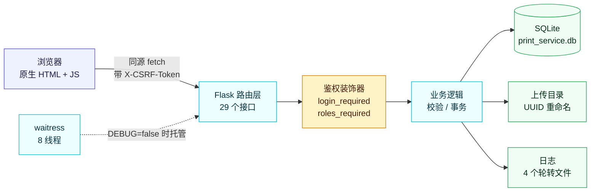
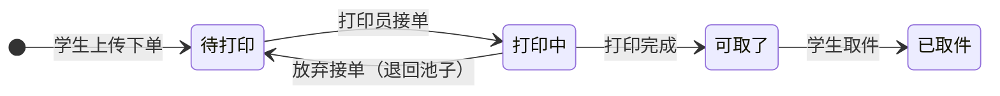
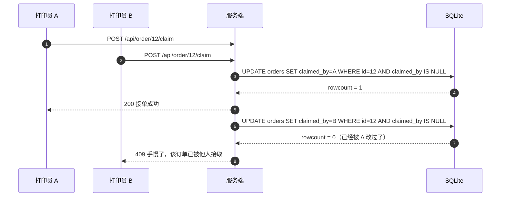
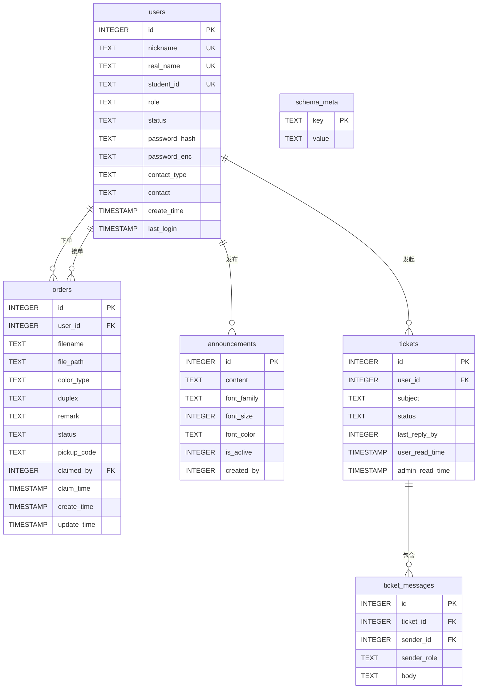

<div align="center">


一个跑在宿舍里的小服务：**学生用手机上传文件下单，打印员在后台接单、打完点一下标记「可取了」。**
不用装 App，不用加微信，打开网页就能用。

<br />

<!-- 技术栈徽章 -->
<a href="https://www.python.org/"></a>
<a href="https://flask.palletsprojects.com/"></a>
<a href="https://www.sqlite.org/"></a>


<!-- 项目状态徽章 -->


<!-- 下面这几个徽章的数据由 GitHub 实时读出来，不用手动维护 -->


<br />
<br />

<!-- 仓库卡片（Socialify 生成）和 Star 曲线。
     这里本来放的是 github-readme-stats 的卡片，但它公共实例当时整站 503，
     连它自己项目的卡片都出不来，只好换成 Socialify。它哪天恢复了想换回去，
     把下面这个 <a> 里的 img 换成
     https://github-readme-stats.vercel.app/api/pin/?username=qcmb825&repo=print-of-dorm 即可。
     Star 曲线用 prefers-color-scheme 备了深浅两版，跟随 GitHub 的深浅色自动切。 -->
<a href="https://github.com/qcmb825/print-of-dorm">
  
</a>

<br />

<a href="https://star-history.com/#qcmb825/print-of-dorm&Date">
  <picture>
    <source media="(prefers-color-scheme: dark)" srcset="https://api.star-history.com/svg?repos=qcmb825/print-of-dorm&type=Date&theme=dark" />
    <source media="(prefers-color-scheme: light)" srcset="https://api.star-history.com/svg?repos=qcmb825/print-of-dorm&type=Date" />
    
  </picture>
</a>

</div>

---

## 📖 这是个什么项目

宿舍楼的打印机一直是老流程：在群里发个文件，等店主回一句「好了」。文件容易被刷走，店主也记不清谁打了谁没打。

所以我把流程搬到了网页上：

- **学生端**：选文件 → 选黑白/彩色、单面/双面 → 留个备注 → 下单。下单后能随时看到自己的订单卡在哪一步，还会拿到一个取件码。
- **打印员端**：看到所有待接单的订单，**先到先得地接单**，打完点一下把状态推到「可取了」。
- **店主端**：管理账号、发公告、看数据看板，还能处理学生发来的工单。

整个东西是**一个 Python 文件 + 一个 HTML 文件**，没有 npm、没有构建步骤、没有数据库服务要装。拷过去、装好依赖、启动，就能用。

---

## ✨ 功能一览

<table>
<tr><th width="140">模块</th><th>做了什么</th></tr>
<tr>
<td><b>账号体系</b></td>
<td>

- 登录 / 注册**同一个入口**，注册即实名（昵称 + 姓名 + 学号）
- 昵称、姓名、学号三者都唯一，所以一个人只能有一个账号
- 三种角色：普通用户 / 管理员 / 超级管理员，权限逐级收窄
- 停用、改角色、删除账号都是超管专属；**任何人都不能改自己的角色**，防手滑把自己锁死
- 超级管理员账号**不可被降级、停用、删除**

</td>
</tr>
<tr>
<td><b>下单与接单</b></td>
<td>

- 上传文件按 UUID 重命名后落盘，原始文件名单独存库，对单用
- 可选黑白/彩色、单面/双面、备注
- 接单是**数据库层原子操作**，两个人同时点「接单」只有一个能成功，另一个收到「手慢了」
- 接错了可以「放弃接单」，订单退回待接单池
- 订单状态四档：`待打印` → `打印中` → `可取了` → `已取件`
- 只有接单人（和超管）能改状态，跨人操作会**记安全日志并返回 403**

</td>
</tr>
<tr>
<td><b>文件下载</b></td>
<td>

- 只有**接单人**和超管能下载订单文件 —— 包括下单人本人也不行
- 这是刻意设计的：学生只负责上传和看状态，实体文件归打印员用
- 下载前会校验「解析后的真实路径必须在上传目录内」，挡住路径穿越

</td>
</tr>
<tr>
<td><b>公告</b></td>
<td>

- 顶部悬浮公告栏，支持 5 种字体白名单 / 字号 12-28 / 颜色，正文上限 500 字
- 同一时间只有一条生效，历史公告留着，随时切回来或改一改再发
- 换公告会重新弹给用户，同一条则尊重用户「已关闭」的选择，不反复骚扰

</td>
</tr>
<tr>
<td><b>工单（站内信）</b></td>
<td>

- 学生遇到问题直接发工单，不用加微信
- 两边都是气泡对话界面，双方各自有未读计数
- 用「双方各自最后已读时间」算未读，天然支持**多个管理员一起处理**

</td>
</tr>
<tr>
<td><b>数据看板</b></td>
<td>

- 订单总量、已接单/未接单、账号活跃数、近 7 天新增
- 状态分布、彩色/单双面占比、近 14 天趋势、接单 Top 5
- **图表是原生 SVG 手画的**，不引任何图表库和外部 CDN（宿舍网络你懂的）

</td>
</tr>
<tr>
<td><b>日志与审计</b></td>
<td>

- 四个日志文件按用途分流：业务 / 访问 / 安全 / 第三方
- 按大小自动轮转，磁盘不会被刷爆
- 敏感操作留痕，但**绝不记录密码本身**

</td>
</tr>
</table>

---

## 👥 角色与权限

| 能力 | 普通用户 | 管理员 | 超级管理员 |
| :--- | :---: | :---: | :---: |
| 上传文件下单 | ✅ | ✅ | ✅ |
| 查看自己的订单 + 取件码 | ✅ | ✅ | ✅ |
| 发起工单 / 回复工单 | ✅ | ✅ | ✅ |
| 查看待接单池、接单 / 放弃接单 | ❌ | ✅ | ✅ |
| 修改订单状态 | ❌ | 仅自己接的单 | ✅ 全部 |
| 下载订单文件 | ❌ | 仅自己接的单 | ✅ 全部 |
| 数据看板 | ❌ | ✅ | ✅ |
| 发公告 | ❌ | ✅ | ✅ |
| 查看账号列表 | ❌ | ✅（**看不到超管**） | ✅ 全部 |
| 查看账号明文密码 | ❌ | ❌ | ✅ |
| 停用 / 改角色 / 删除账号 | ❌ | ❌ | ✅ |

> 管理员不仅能看的账号列表里没有超管，**统计数据里也没有超管** —— 否则列表显示 3 个、统计说 4 个，等于变相告诉你还有一个看不见的账号。挡了列表却漏了数字，等于没挡。

---

## 🏗️ 技术栈

| 层 | 选型 | 为什么是它 |
| :--- | :--- | :--- |
| 语言 | Python 3.9+（开发环境 3.11.9） | 宿舍服务器就是台 Windows 小主机 |
| 框架 | Flask 3.1.3 | 单机低并发，Flask 完全够用，也不需要学习成本 |
| 数据库 | **标准库 `sqlite3`**（同步） | 数据量就几千条，单文件零运维，备份就是拷个文件 |
| 跨域 | Flask-Cors 6.0.5 | 给将来做小程序端预留；**默认留空，只允许同源** |
| 生产服务器 | waitress 3.0.2 | 纯 Python，Windows 上装得最省事，8 线程 |
| 加密 | cryptography 46.0.3 | Fernet 对称加密，为「超管查看密码」这个需求服务 |
| 前端 | 原生 HTML + JS + CSS，Jinja2 渲染 | 一个页面搞定，不引框架、不引 CDN、不需要构建 |

<details>
<summary><b>为什么数据库不换成 MySQL / 不上异步 ORM？</b></summary>

<br />

这项目从第一天就是**单机 + 低并发**：一个宿舍楼的打印需求，峰值也就是十几个人同时下单。

- 数据量：一个学期撑死几千条订单，SQLite 一个文件就能扛
- 并发量：读写都是毫秒级，SQLite 的写锁根本不会成为瓶颈
- 运维成本：SQLite 的备份 = 拷一个 `.db` 文件；接 MySQL 就要多一个要维护、要监控、会挂的服务

上异步数据库反而更糟：整套代码得改成 `async`，Flask 要换成 Quart 之类的异步框架，多出一堆 await，**换来的收益是零**。

真到了需要 MySQL 的那天，`app.py` 里已经把 `DB_*` 配置项预留好了。

</details>

---

## 🧠 架构与关键设计

### 请求怎么走



### 订单状态流转



### 接单为什么不需要分布式锁

两个人同时看到同一个待接单订单，同时点「接单」——靠的不是锁，而是**一条带条件的 UPDATE**：



`WHERE claimed_by IS NULL` 这一句让判断和写入变成**一个原子操作**，数据库自己保证了「只有一个 UPDATE 能改到这一行」。所以日志里能看到「接单竞争失败」这种记录，但永远不会出现两个人同时接单成功。

### 密码为什么存了两份

这是整个项目里最需要解释的一个设计。

| 字段 | 加密方式 | 用途 | 能不能还原 |
| :--- | :--- | :--- | :---: |
| `password_hash` | PBKDF2-SHA256（加盐） | **登录校验** | ❌ 不可逆 |
| `password_enc` | Fernet 对称加密 | 超管「查看密码」功能 | ✅ 可逆 |

需求里有一条是「超级管理员要能看到各账号的密码」，但只靠哈希是**永远还原不出明文**的（这正是哈希的意义）。两条路：

1. 跟用户说「密码看不到」→ 需求没满足
2. 再加一份可逆加密的副本 → 需求满足了，但安全性确实被削弱了

我选了第 2 条，但把风险收窄到最小：**明文只有超管能拿到，而且每一次查看都会写进 `security.log` 留痕**（只记「谁、何时、看了几个账号」，不记密码内容）。

再强调一次：`PASSWORD_ENC_KEY` 换了之后，历史账号的密码就再也解不开了（登录不受影响，因为登录走哈希）。这个密钥要和数据库一起备份。

---

## 🚀 快速开始

### 1. 准备

- Python **3.9 或以上**（我开发和部署用的是 3.11.9）
- Windows / Linux / macOS 都行，Windows 上验证得最多

### 2. 装依赖

把项目放到服务器上（`git clone` 或直接拷目录），然后在项目根目录：

```powershell
python -m venv .venv
.\.venv\Scripts\python.exe -m pip install -r requirements.txt
```

Linux / macOS 换成 `.venv/bin/python -m pip install -r requirements.txt` 即可。

### 3. 生成两个密钥

这两个密钥**只在首次部署时生成一次，之后不要再换**（换了会掉线 / 密码解不开）：

```powershell
# 会话签名密钥
.\.venv\Scripts\python.exe -c "import secrets; print(secrets.token_hex(32))"

# 密码加密密钥（注意结尾那个 = 号，是 Fernet 格式的一部分）
.\.venv\Scripts\python.exe -c "from cryptography.fernet import Fernet; print(Fernet.generate_key().decode())"
```

### 4. 写 `.env`

在项目根目录新建 `.env`。**最小可用配置**长这样：

```ini
# 必填：两个密钥，填上第 3 步生成的值
SECRET_KEY=把上面第一个命令的输出粘这里
PASSWORD_ENC_KEY=把上面第二个命令的输出粘这里

# 必填：超管初始密码，8-64 位
SUPER_ADMIN_PASSWORD=换成你自己的强密码

# 建议改：数据和文件放代码目录外面，升级代码时不会误删
DATABASE_PATH=D:/print_data/print_service.db
UPLOAD_FOLDER=D:/print_data/files/

# 生产环境必须是 false
DEBUG=false
```

> ⚠️ `SUPER_ADMIN_PASSWORD` 如果没设、或者位数不在 **8-64** 之间，程序**不会报错**，而是悄悄随机生成一个密码并只在日志里留一行 `WARNING`。然后你登录时会一直看到「账号或密码错误」，很容易在这里卡半天。所以这个值一定要显式写好。

### 5. 启动

```powershell
.\.venv\Scripts\python.exe app.py
```

程序会根据 `DEBUG` **自动选择服务器**，不用改命令：

| `DEBUG` | 实际用的服务器 | 适用场景 |
| :--- | :--- | :--- |
| `true` | Flask 内置开发服务器 | 本地调试，**会暴露源码，仅限本机** |
| `false` | **waitress**（8 线程） | 生产环境 |

首次启动会自动建表，并按 `.env` 创建超级管理员账号，日志里会打印「启动横幅」：

```
[INFO] 宿舍自助打印服务 —— 启动
[INFO]   数据文件 : D:/print_data/print_service.db
[INFO]   上传目录 : D:/print_data/files/
[INFO]   允许上传 : doc、docx、jpeg、jpg、pdf、png
[INFO]   登录策略 : 连续失败 5 次锁定 300 秒；登录态保持 7 天
```

浏览器打开 `http://<服务器IP>:8080`，用超管账号登录就进去了。

### 6. 设成开机自启

用 `nssm` 或 Windows「任务计划程序」把上面的启动命令注册成服务。

---

## ⚙️ 配置项

全部通过 `.env` 注入，**优先级：系统环境变量 > `.env` 文件 > 代码里的默认值**。
所以临时改端口不用动文件：`$env:PORT='9000'`。

<details>
<summary><b>展开完整配置表</b></summary>

<br />

**网络与运行**

| 变量 | 默认值 | 说明 |
| :--- | :--- | :--- |
| `HOST` | `0.0.0.0` | 监听地址 |
| `PORT` | `8080` | 监听端口 |
| `DEBUG` | `false` | 生产必须 `false` |
| `CORS_ORIGINS` | 空 | 跨域白名单，逗号分隔；**留空 = 只允许同源** |
| `TRUST_PROXY` | `false` | 前面是否挂了反向代理（见下方安全提示） |

**存储**

| 变量 | 默认值 | 说明 |
| :--- | :--- | :--- |
| `UPLOAD_FOLDER` | `C:/print/print_files/` | 打印文件目录，不存在会自动创建 |
| `DATABASE_PATH` | `print_service.db` | SQLite 文件位置，相对路径按 `app.py` 所在目录解析 |
| `MAX_UPLOAD_MB` | `50` | 单文件上传上限 |
| `ALLOWED_EXTENSIONS` | `pdf,jpg,jpeg,png,doc,docx` | 上传白名单，逗号分隔 |

**安全**

| 变量 | 默认值 | 说明 |
| :--- | :--- | :--- |
| `SECRET_KEY` | 空（缺失时随机生成 + 告警） | 会话签名密钥，**必须固定**，否则每次重启全员掉线 |
| `PASSWORD_ENC_KEY` | 空（缺失时告警） | 密码可逆加密密钥，**必须固定且与数据库同寿命** |
| `SESSION_DAYS` | `7` | 登录状态保持天数 |
| `SESSION_COOKIE_SECURE` | `false` | **挂上 HTTPS 后务必改成 `true`** |
| `LOGIN_MAX_FAILS` | `5` | 连续失败几次锁定该账号 |
| `LOGIN_LOCK_SECONDS` | `300` | 锁定时长（秒） |

**超级管理员**

| 变量 | 默认值 | 说明 |
| :--- | :--- | :--- |
| `SUPER_ADMIN_NICKNAME` | `superadmin` | 昵称，**兼作登录名，也是判断「要不要创建」的唯一依据** |
| `SUPER_ADMIN_REALNAME` | 空 | 姓名，可留空 |
| `SUPER_ADMIN_STUDENT_ID` | 空 | 学号，可留空 |
| `SUPER_ADMIN_DORM` | 空 | 宿舍/位置，留空则界面只显示昵称 |
| `SUPER_ADMIN_PASSWORD` | 空 | 初始密码，**必须是 8-64 位** |

> 姓名 / 学号 / 宿舍三个留空会存成空字符串，但 `real_name` 和 `student_id` 在库里都是 `UNIQUE` 唯一约束——**空字符串也算一个值**，所以最多只能有一个超管把这两项同时留空，第二个会撞唯一约束（日志里报 `IntegrityError`）。

**日志**

| 变量 | 默认值 | 说明 |
| :--- | :--- | :--- |
| `LOG_LEVEL` | `INFO` | `DEBUG` 会记录只读请求，排查时再用 |
| `LOG_DIR` | `logs` | 日志目录 |
| `LOG_FILE` | `app.log` | 业务日志文件名 |
| `LOG_MAX_BYTES` | `5242880`（5MB） | 单文件上限，写满自动轮转 |
| `LOG_BACKUP_COUNT` | `10` | 保留几个历史文件 |
| `LOG_CONSOLE` | `true` | 是否同时输出到控制台 |
| `LOG_ACCESS` | `true` | 是否记录访问日志 |

**启动重试**

| 变量 | 默认值 | 说明 |
| :--- | :--- | :--- |
| `START_MAX_ATTEMPTS` | `3` | 端口被临时占用 / 被拒时最多重试几次 |
| `START_RETRY_SECONDS` | `3` | 两次重试之间等几秒 |

**预留未使用**

| 变量 | 说明 |
| :--- | :--- |
| `DB_HOST` / `DB_USER` / `DB_PASSWORD` / `DB_NAME` / `DB_CHARSET` | 为将来迁 MySQL 预留，**当前代码里完全没用到** |

</details>

---

## 📡 API 一览

<details>
<summary><b>展开 29 个接口</b></summary>

<br />

所有接口统一返回 `{"code": 0, "msg": "..."}`，`code != 0` 即失败。
**所有写操作都要带 CSRF 令牌**（见下方「安全设计」），用 Postman 裸调会收到 403，这是预期行为。

**通用**

| 方法 | 路径 | 权限 | 说明 |
| :--- | :--- | :--- | :--- |
| `GET` | `/` | 公开 | 首页（登录页 / 主界面同一份 HTML） |
| `GET` | `/hello` | 公开 | 存活探针 |
| `POST` | `/api/register` | 公开 | 注册（昵称/姓名/学号重复返回 409） |
| `POST` | `/api/login` | 公开 | 登录（**昵称或姓名都能当账号用**，含失败锁定，锁定时返回 429） |
| `POST` | `/api/logout` | 公开 | 登出 |
| `GET` | `/api/me` | 公开 | 当前用户信息 + **下发 CSRF 令牌**（未登录时返回 401 但依然发令牌） |

**订单**

| 方法 | 路径 | 权限 | 说明 |
| :--- | :--- | :--- | :--- |
| `POST` | `/api/upload` | 登录 | 上传文件并下单 |
| `GET` | `/api/orders` | 管理员 / 超管 | 订单列表（全部 / 待接单池 / 我接的） |
| `GET` | `/api/my-orders` | 登录 | 只看自己的订单 |
| `POST` | `/api/order/<id>/claim` | 管理员 | 接单（原子，失败 409） |
| `POST` | `/api/order/<id>/release` | 管理员 | 放弃接单，退回池子 |
| `PUT` | `/api/order/<id>/status` | 管理员 | 改状态，状态非法返回 400 |
| `GET` | `/api/order/<id>/download` | 接单人 / 超管 | 下载订单文件 |

**账号管理**

| 方法 | 路径 | 权限 | 说明 |
| :--- | :--- | :--- | :--- |
| `GET` | `/api/admin/users` | 管理员 / 超管 | 账号列表；`?with_password=1` 仅超管可用 |
| `PUT` | `/api/admin/user/<id>/role` | 超管 | 改角色 |
| `PUT` | `/api/admin/user/<id>/status` | 超管 | 停用 / 启用 |
| `DELETE` | `/api/admin/user/<id>` | 超管 | 删除账号（订单保留，解除归属） |
| `GET` | `/api/admin/stats` | 管理员 / 超管 | 数据看板（管理员的统计口径不含超管） |

**公告**

| 方法 | 路径 | 权限 | 说明 |
| :--- | :--- | :--- | :--- |
| `GET` | `/api/announcement` | 登录 | 取当前生效的公告 |
| `GET` | `/api/admin/announcements` | 管理员 / 超管 | 公告列表（含历史） |
| `POST` | `/api/admin/announcements` | 管理员 / 超管 | 新建并设为生效 |
| `PUT` | `/api/admin/announcements/<id>` | 管理员 / 超管 | 编辑 |
| `PUT` | `/api/admin/announcements/<id>/active` | 管理员 / 超管 | 切换生效公告 |
| `DELETE` | `/api/admin/announcements/<id>` | 管理员 / 超管 | 删除 |

**工单**

| 方法 | 路径 | 权限 | 说明 |
| :--- | :--- | :--- | :--- |
| `GET` | `/api/tickets` | 登录 | 工单列表（按角色返回不同范围） |
| `POST` | `/api/tickets` | 登录 | 发起工单 |
| `GET` | `/api/tickets/<id>` | 登录 | 工单详情 + 消息（同时标记已读） |
| `POST` | `/api/tickets/<id>/messages` | 登录 | 回复 |
| `PUT` | `/api/tickets/<id>/status` | 登录 | 关闭 / 重新打开（工单归属人和管理员、超管都能操作） |

</details>

---

## 🗄️ 数据模型



> 未读数不是「存一个数字」，而是用 **`user_read_time` / `admin_read_time` 两个时间戳 + 消息时间** 现算出来的。好处是天然支持多个管理员同时处理工单 —— 谁看过就更新谁那边的已读时间，不会互相覆盖。

---

## 🔐 安全设计

这项目从原型到能上线，安全这块补了不少东西。逐条列一下，也当作自查清单：

<table>
<tr><th width="150">问题</th><th>做法</th></tr>
<tr>
<td><b>CSRF</b></td>
<td>

所有写操作都要带 `X-CSRF-Token` 请求头，令牌从 `/api/me` 下发、存在会话里，服务端用 `secrets.compare_digest` 做**定长时间比较**（防时序侧信道）。登录成功时会 `session.clear()` 重建会话，防会话固定攻击。

</td>
</tr>
<tr>
<td><b>存储型 XSS</b></td>
<td>

文件名是用户可控的。原型版本用模板字符串拼 `innerHTML`，上传一个名字叫 `` 的文件就能在店主页面上执行脚本。

现在前端**所有文本一律走 `textContent`**，从根上免疫，不需要手写转义函数。

</td>
</tr>
<tr>
<td><b>上传滥用</b></td>
<td>

三重收口：扩展名**白名单**（默认 `pdf,jpg,jpeg,png,doc,docx`）+ `MAX_UPLOAD_MB` 大小限制 + 存盘时 **UUID 重命名**（原始文件名只进数据库）。

</td>
</tr>
<tr>
<td><b>路径穿越</b></td>
<td>

下载前会 `resolve()` 出真实路径，再校验它确实在 `UPLOAD_FOLDER` 里面。库里的路径正常不可能跑到外面，所以一旦触发就按**安全事件**记日志。

</td>
</tr>
<tr>
<td><b>越权</b></td>
<td>

`@login_required` / `@roles_required(*roles)` 两个装饰器统一收口。改状态和下载都额外校验「这单是不是你接的」，跨人操作返回 403 并记安全日志。

</td>
</tr>
<tr>
<td><b>账号枚举</b></td>
<td>

登录失败对外**永远只回「账号或密码错误」**，但 `security.log` 里会写明真实原因（账号不存在 / 密码错误 / 账号已被停用），方便运维排查。

</td>
</tr>
<tr>
<td><b>暴力破解</b></td>
<td>

同一账号连续失败 `LOGIN_MAX_FAILS`（默认 5）次后锁定 `LOGIN_LOCK_SECONDS`（默认 300）秒。

</td>
</tr>
<tr>
<td><b>CSS 注入</b></td>
<td>

公告支持自定义字体、字号、颜色，但这些值都**先过白名单**：字体只能是白名单里的键、字号限制 12-28、颜色必须匹配 `#RRGGBB`。数据库里绝不存任意 CSS 字符串，免得公告表变成样式注入入口。

</td>
</tr>
<tr>
<td><b>IP 伪造</b></td>
<td>

`TRUST_PROXY` **默认关闭**。只有真的挂了 Nginx/Caddy 才打开 —— 打开后程序会采信 `X-Forwarded-For`，而这个头**客户端可以随便伪造**，代理不受你控制时开它等于让攻击者随意伪造 IP，安全日志就废了。

</td>
</tr>
<tr>
<td><b>审计留痕</b></td>
<td>

超管查看明文密码、越权访问、CSRF 拦截、路径穿越，全部写进 `security.log`。但**只记「谁、何时、几个账号」，绝不记密码内容** —— 日志不能变成第二个泄露源。

</td>
</tr>
</table>

---

## 📋 日志系统

启动后 `LOG_DIR`（默认 `logs/`）下会有四个文件，按用途分流，出问题直接找对的那个：

| 文件 | 里面是什么 | 什么时候看 |
| :--- | :--- | :--- |
| `app.log` | 业务日志：启动横幅、注册、登录、下单、接单、改状态、下载 | 想知道「系统都干了什么」 |
| `access.log` | 访问日志：方法、路径、状态码、耗时、响应大小、IP、账号、UA | 想知道「哪个接口慢 / 谁在刷接口」 |
| `security.log` | 安全日志：登录失败与锁定、CSRF 拦截、越权、路径穿越、审计留痕 | **怀疑被搞了，或者要追责某次管理操作** |
| `other.log` | 框架/第三方库的 WARNING 以上告警（如 waitress 的提示） | 一般用不到 |

三个关键设计：

- **分级落盘**：`5xx` → ERROR，`4xx` → WARNING，写操作 → INFO，**只读成功请求 → DEBUG（默认不落盘）**。
  这不是洁癖：前端每 10 秒自动刷新一次订单列表，只读请求也按 INFO 记的话，日志半天就被刷爆了。要全量排查时把 `LOG_LEVEL` 调成 `DEBUG`。
- **按大小轮转**：单文件超过 5MB 滚成 `app.log.1`，最多留 10 个，磁盘不会被撑爆。
- **中文不乱码**：启动时会强制把控制台输出切成 UTF-8，Windows 下也不会出现乱码。

> 🔒 `logs/` 里有客户端 IP、账号昵称、操作记录和文件路径，属于隐私数据。`.gitignore` 已经忽略，**不要提交到仓库**。

---

## 📁 目录结构

```
print of dorm/
├── app.py                 # 全部后端逻辑（配置 + 路由 + 数据库 + 鉴权 + 日志）
├── templates/
│   └── index.html         # 唯一的前端页面（登录页 + 用户端 + 管理端）
├── requirements.txt       # 依赖清单
├── .gitignore
├── .gitattributes
└── README.md
```

本地跑起来之后还会多出这些（**都已在 `.gitignore` 里，不会提交**）：

```
├── .env                   # 真实配置，含密钥，绝对不要提交
├── .venv/                 # 虚拟环境
├── logs/                  # 四个日志文件
├── *.db                   # SQLite 数据库
└── *.md (除 README)       # 本地文档，比如 DEPLOY.md
```

> 这一版前端是**单文件**：HTML、CSS、JS 全在 `templates/index.html` 里。好处是部署时只要拷两个文件，坏处是这个文件有一千多行 —— 想拆分的话见下面的后续计划。

---

## 🧩 已知不足与后续计划

写在这里，免得自己忘了，也免得别人踩坑：

- [ ] **前端单文件太长**。`templates/index.html` 一千多行，改一处要来回翻。计划拆成 `static/css/` + `static/js/` 多个模块。
- [ ] **订单只增不减**。目前没有清理策略，也没有分页（数据量还小，先不管）。想加的话应该是「已取件 N 天后归档」。
- [ ] **没有自动化测试**。现在是手工点一遍主要流程，这块确实欠着。
- [ ] **CSRF 令牌存在会话里**，多标签页同时开太久需要刷新页面重新取令牌。
- [ ] **没有限流**。上传接口目前只靠大小和白名单挡，恶意高频提交挡不住。
- [ ] **时间统一用 UTC**。`CURRENT_TIMESTAMP` 写的是 UTC，展示层再转本地时间（近 14 天趋势那条 SQL 已经用 `localtime` 转过了）。
- [ ] **超管密码忘了没有自助找回**。程序只按昵称判断「要不要创建」，昵称还在就跳过、不会重设。补救办法是**在 `.env` 里换个新昵称重启**，补出一个新超管，登录后到「账号管理」里把旧的删掉。
- [ ] **数据库结构变更会重建订单表**。`schema_meta.schema_version` 不匹配时会 `DROP TABLE orders` 重建（当前版本 `3`），**升级前一定要先备份数据库和上传目录**。

---

## 📄 版权声明

**Copyright © 2026. All Rights Reserved.**

本项目为个人作品，代码仅供学习与参考，**未授予任何开源许可**。

未经作者书面许可，不得用于商业用途，不得二次分发，不得删除或修改本声明。
如需在宿舍、公寓等场景实际部署使用，请先联系作者。

---

<div align="center">

**如果这个项目帮到了你，点个 ⭐ 就是最好的支持。**

<sub>Made with ☕ and a lot of <code>netstat -ano | findstr :8080</code></sub>

</div>
