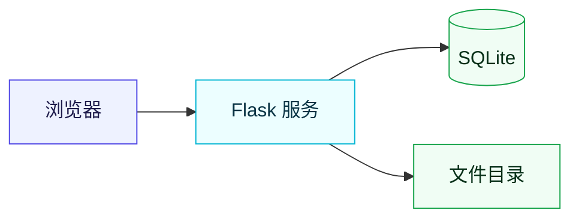
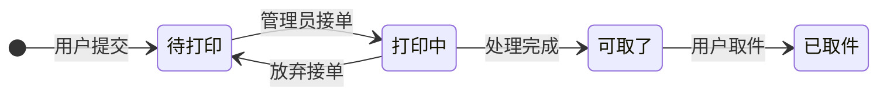

<div align="center">


一个轻量的 **打印作业管理系统**：提交打印任务、接单处理、完成取件全流程在一个网页里跑完。
纯 Web 界面，不需要安装客户端。

<br />

<!-- 技术栈徽章 -->
<a href="https://www.python.org/"></a>
<a href="https://flask.palletsprojects.com/"></a>
<a href="https://www.sqlite.org/"></a>


<!-- 项目状态徽章 -->


<!-- 下面这几个徽章的数据由 GitHub 实时读出来，不用手动维护 -->


<br />
<br />

<!-- 仓库卡片（Socialify 生成）和 Star 曲线。
     这里本来放的是 github-readme-stats 的卡片，但它公共实例当时整站 503，
     连它自己项目的卡片都出不来，只好换成 Socialify。它哪天恢复了想换回去，
     把下面这个 <a> 里的 img 换成
     https://github-readme-stats.vercel.app/api/pin/?username=qcmb825&repo=print-of-dorm 即可。
     Star 曲线用 prefers-color-scheme 备了深浅两版，跟随 GitHub 的深浅色自动切。 -->
<a href="https://github.com/qcmb825/print-of-dorm">
  
</a>

<br />

<a href="https://star-history.com/#qcmb825/print-of-dorm&Date">
  <picture>
    <source media="(prefers-color-scheme: dark)" srcset="https://api.star-history.com/svg?repos=qcmb825/print-of-dorm&type=Date&theme=dark" />
    <source media="(prefers-color-scheme: light)" srcset="https://api.star-history.com/svg?repos=qcmb825/print-of-dorm&type=Date" />
    
  </picture>
</a>

</div>

---

## 📖 项目简介

一个轻量的**打印作业管理系统**，把「提交任务 → 接单处理 → 完成取件」这条流程搬到网页上：

- **普通用户**：选文件 → 选黑白/彩色、单面/双面 → 留个备注 → 提交。提交后能随时看到任务卡在哪一步，还会拿到一个取件码。
- **管理员**：看到所有待接单的任务，**先到先得地接单**，处理完点一下把状态推到「可取了」。在此之上还能发布公告、查看数据看板、处理用户工单。

整个系统是**几个 Python 模块 + 一个 HTML 文件**，没有 npm、没有构建步骤、没有数据库服务要装。装好依赖、启动，就能用。

---

## ✨ 功能一览

<table>
<tr><th width="140">模块</th><th>做了什么</th></tr>
<tr>
<td><b>账号体系</b></td>
<td>

- 登录 / 注册**同一个入口**，注册时填基本信息
- 昵称、姓名、学号唯一，一个人只能有一个账号
- 两种角色：普通用户 / 管理员
- 首次启动按 `.env` 的 `SUPER_ADMIN_*` 创建一个内置管理账号。密码**必须**在首次启动前自己设好（至少 8 位），没配够程序会拒绝启动

</td>
</tr>
<tr>
<td><b>下单与接单</b></td>
<td>

- 上传文件、选打印方式、留备注，一步提交
- 可选黑白/彩色、单面/双面
- 两个人同时点「接单」，只有一个能成功，不会重复接同一单
- 支持「放弃接单」，订单退回待接单池
- 订单状态：待打印 → 打印中 → 可取了 → 已取件

</td>
</tr>
<tr>
<td><b>文件下载</b></td>
<td>

- 只有**接单人**能下载订单文件
- 上传与取件分离：提交人只负责上传和看状态，实体文件归接单的管理员使用

</td>
</tr>
<tr>
<td><b>公告</b></td>
<td>

- 顶部悬浮公告栏，可设字体、字号、颜色
- 同一时间只有一条生效，历史公告留存，可随时切回或再编辑

</td>
</tr>
<tr>
<td><b>工单（站内信）</b></td>
<td>

- 用户遇到问题直接发站内工单，不用加好友
- 气泡对话界面，双方各有未读提示
- 支持多个管理员一起处理

</td>
</tr>
<tr>
<td><b>数据看板</b></td>
<td>

- 订单总量、已接单/未接单、账号活跃数、近 7 天新增
- 状态分布、彩色/单双面占比、近期趋势、接单排行
- 图表为原生 SVG，不依赖任何图表库和外部 CDN

</td>
</tr>
<tr>
<td><b>日志与审计</b></td>
<td>

- 日志按用途分流（业务 / 访问 / 安全 / 第三方）
- 按大小自动轮转，磁盘不会被刷爆
- 敏感操作留痕，但**不记录任何凭据内容**

</td>
</tr>
</table>

---

## 👥 角色与权限

| 能力 | 普通用户 | 管理员 |
| :--- | :---: | :---: |
| 提交打印订单 | ✅ | ✅ |
| 查看自己的订单 | ✅ | ✅ |
| 发起 / 回复工单 | ✅ | ✅ |
| 接单、处理订单 | ❌ | ✅ |
| 下载订单文件 | ❌ | ✅ |
| 数据看板、发布公告 | ❌ | ✅ |
| 停用 / 改角色 / 注销账号 | ❌ | 🔑 |

> 权限校验统一在服务端完成，前端只是根据角色决定渲染哪些界面。
>
> 🔑 这三个接口只对**部署时自动创建的那个内置管理账号**开放，
> 账号由 `.env` 的 `SUPER_ADMIN_*` 在首次启动时创建，普通管理员调用会返回 403。
>
> **注销不是删除**：注销只把账号置为不可登录，历史订单、工单等信息全部保留；
> 它占用的昵称、姓名、学号会被释放，可以重新注册。注销不可恢复。

---

## 🏗️ 技术栈

| 层 | 选型 |
| :--- | :--- |
| 语言 | Python 3.9+ |
| 框架 | Flask |
| 数据库 | 标准库 `sqlite3` |
| 生产服务器 | waitress |
| 密码加密 | cryptography |
| 前端 | 原生 HTML + JS + CSS（Jinja2 渲染） |

---

## 🧠 架构



单机单体服务：浏览器访问一个 Flask 进程，数据写 SQLite，上传的文件落本地目录。

### 订单状态流转



---

## 🚀 快速开始

### 1. 准备

- Python **3.9 或以上**（我开发和部署用的是 3.11.9）
- Windows / Linux / macOS 都行，Windows 上验证得最多

### 2. 装依赖

把项目放到服务器上（`git clone` 或直接拷目录），然后在项目根目录：

```powershell
python -m venv .venv
.\.venv\Scripts\python.exe -m pip install -r requirements.txt
```

Linux / macOS 换成 `.venv/bin/python -m pip install -r requirements.txt` 即可。

### 3. 生成两个密钥

这两个密钥**只在首次部署时生成一次，之后不要再换**（换了会掉线 / 已存的数据解不开）：

```powershell
# 会话签名密钥
.\.venv\Scripts\python.exe -c "import secrets; print(secrets.token_hex(32))"

# 密码加密密钥（连同结尾的 = 号一起复制）
.\.venv\Scripts\python.exe -c "from cryptography.fernet import Fernet; print(Fernet.generate_key().decode())"
```

### 4. 写 `.env`

在项目根目录新建 `.env`。**最小可用配置**长这样：

```ini
# 必填：两个密钥，填上第 3 步生成的值
SECRET_KEY=把上面第一个命令的输出粘这里
PASSWORD_ENC_KEY=把上面第二个命令的输出粘这里

# 必填：内置管理账号。密码至少 8 位
SUPER_ADMIN_NICKNAME=superadmin
SUPER_ADMIN_PASSWORD=自己想一个至少 8 位的密码
SUPER_ADMIN_REALNAME=张三
SUPER_ADMIN_STUDENT_ID=2024001
SUPER_ADMIN_DORM=3号楼512

# 建议改：数据和文件放代码目录外面，升级代码时不会误删
DATABASE_PATH=D:/print_data/print_service.db
UPLOAD_FOLDER=D:/print_data/files/

# 生产环境必须是 false
DEBUG=false
```

> ⚠️ **`SUPER_ADMIN_PASSWORD` 首次启动必须填够 8 位。** 账号还没建、密码又不合格时，程序会**直接拒绝启动**，并在控制台打出 `[启动中止]` 和该补的变量名。
>
> 这是刻意设计的。以前的做法是随机生成一个密码、只在启动日志里留一行 `WARNING` —— 等于把管理员口令写进了日志文件，而日志恰恰是最容易被整包拷走、发给别人帮你看问题的东西。现在改成让部署错误在启动时就显形。
>
> 账号建好之后，这一行可以删掉：判断「账号是否已存在」排在密码校验**之前**，删掉不影响后续重启。
>
> 另外 `SUPER_ADMIN_REALNAME` 和 `SUPER_ADMIN_STUDENT_ID` 都是 UNIQUE 字段 —— 同时建多个内置账号时，不能都留空。

### 5. 启动

```powershell
.\.venv\Scripts\python.exe app.py
```

程序会根据 `DEBUG` **自动选择服务器**，不用改命令：

| `DEBUG` | 实际用的服务器 | 适用场景 |
| :--- | :--- | :--- |
| `true` | Flask 内置开发服务器 | 本地调试，**会暴露源码，仅限本机** |
| `false` | **waitress** | 生产环境 |

首次启动会自动建表、按 `.env` 创建初始管理员账号，并在日志里打印一条**启动横幅**。

浏览器打开 `http://<服务器IP>:8080`，用初始管理员账号登录即可。

### 6. 设成开机自启

Windows 上用 [nssm](https://nssm.cc/download) 把启动命令包成服务（开机自启 + 崩了自动拉起，不需要有人登录桌面）：

```powershell
nssm install PrintService "D:\print-service\.venv\Scripts\python.exe" "app.py"
nssm set PrintService AppDirectory D:\print-service
nssm set PrintService AppExit Default Restart
nssm set PrintService AppRestartDelay 3000
nssm start PrintService
```

> `AppDirectory` 必须设。不设的话服务的工作目录不是项目目录，相对路径会指向乱七八糟的地方。

Linux 上用 systemd 写一个 `.service`，`ExecStart` 指向 `.venv/bin/python app.py` 即可。

> ⚠️ **不要用 `gunicorn`**。它靠 `fork()` 工作，在 **Windows 上根本起不来**；即使在 Linux 上，多进程也会把内存里的限流阈值成倍放宽（见下方「已知不足」）。项目已装 `waitress`，`DEBUG=false` 时会自动启用。

---

## ⚙️ 配置项

全部通过 `.env` 注入，**优先级：系统环境变量 > `.env` 文件 > 代码里的默认值**。

<details>
<summary><b>展开常用配置</b></summary>

<br />

| 变量 | 默认值 | 说明 |
| :--- | :--- | :--- |
| `HOST` | `0.0.0.0` | 监听地址 |
| `PORT` | `8080` | 监听端口 |
| `DEBUG` | `false` | 生产必须 `false` |
| `DATABASE_PATH` | `print_service.db` | SQLite 文件位置（相对路径按 `app.py` 所在目录解析） |
| `UPLOAD_FOLDER` | `C:/print/print_files/` | 打印文件目录（默认值写死了 Windows 盘符，换平台要改） |
| `MAX_UPLOAD_MB` | `50` | 单文件上传上限 |
| `ALLOWED_EXTENSIONS` | `pdf,jpg,jpeg,png,doc,docx` | 上传白名单 |
| `SECRET_KEY` | 空 | 会话签名密钥，**必须固定**，否则每次重启全体掉线 |
| `PASSWORD_ENC_KEY` | 空 | 密码加密密钥，**必须固定且与数据库同寿命**，换了旧密码解不开 |
| `SESSION_DAYS` | `7` | 登录状态保持天数 |
| `SESSION_COOKIE_SECURE` | `false` | cookie 是否只走 HTTPS。**拿到证书之后再改成 `true`**，提前改会变成「登录成功但一刷新就退出」 |
| `TRUST_PROXY` | `false` | 前面是否挂了反向代理（Nginx 等）。开了才会采用 `X-Forwarded-For` 里的真实客户端 IP；**直接暴露在公网时必须保持 `false`**，否则客户端可以伪造 IP 绕过限流、污染日志 |
| `LOG_CONSOLE` | `true` | 是否同时输出到控制台。服务化运行（NSSM / systemd）时建议改 `false` |
| `LOG_DIR` | `logs` | 日志目录，相对路径按 `app.py` 所在目录解析 |

内置管理账号也在 `.env` 里配置，共 5 项：`SUPER_ADMIN_NICKNAME`、`SUPER_ADMIN_PASSWORD`、
`SUPER_ADMIN_REALNAME`、`SUPER_ADMIN_STUDENT_ID`、`SUPER_ADMIN_DORM`。

> 其余配置（登录锁定、日志轮转、启动重试等）同样在 `config.py` 里，按需查看。

</details>

---

## 📡 接口一览

接口统一返回 `{"code": 0, "msg": "..."}`，`code != 0` 即失败。写操作需要携带会话令牌。

只列主流程上用到的几个：

| 方法 | 路径 | 权限 | 说明 |
| :--- | :--- | :--- | :--- |
| `POST` | `/api/register` | 公开 | 注册 |
| `POST` | `/api/login` | 公开 | 登录 |
| `POST` | `/api/upload` | 登录 | 上传文件并提交订单 |
| `GET` | `/api/my-orders` | 登录 | 自己的订单列表 |
| `GET` | `/api/orders` | 管理员 | 订单列表（含待接单池） |
| `POST` | `/api/order/<id>/claim` | 管理员 | 接单 |
| `PUT` | `/api/order/<id>/status` | 管理员 | 更新订单状态 |

> 公告、工单、看板、账号管理等其余接口不逐一列出，实现见 `routes/` 下对应的模块。

---

## 🗄️ 数据模型

SQLite 单库，共 6 张表：

| 表 | 用途 |
| :--- | :--- |
| `users` | 账号 |
| `orders` | 打印订单 |
| `announcements` | 公告 |
| `tickets` / `ticket_messages` | 工单与消息 |
| `schema_meta` | 结构版本，用于自动建表与升级 |

---

## 🔐 安全设计

<table>
<tr><th width="150">问题</th><th>做法</th></tr>
<tr>
<td><b>CSRF</b></td>
<td>

写操作需携带会话令牌，登录成功后会重建会话。

</td>
</tr>
<tr>
<td><b>存储型 XSS</b></td>
<td>

前端统一按纯文本渲染，不拼接 HTML。

</td>
</tr>
<tr>
<td><b>上传滥用</b></td>
<td>

扩展名白名单 + 大小上限 + 存盘重命名，三重收口。

</td>
</tr>
<tr>
<td><b>路径穿越</b></td>
<td>

下载前校验文件真实路径必须位于上传目录内。

</td>
</tr>
<tr>
<td><b>越权</b></td>
<td>

权限在服务端统一校验，跨人操作返回 403。

</td>
</tr>
<tr>
<td><b>账号枚举</b></td>
<td>

登录失败对外只回「账号或密码错误」。

</td>
</tr>
<tr>
<td><b>暴力破解</b></td>
<td>

连续失败达阈值后锁定账号一段时间。

</td>
</tr>
<tr>
<td><b>密码存储</b></td>
<td>

登录校验用不可逆的 pbkdf2 哈希；另外存一份 Fernet 可逆密文，供内置管理账号在账号管理页查看凭据。**代价是数据库泄露等于全站明文密码泄露** —— `PASSWORD_ENC_KEY` 与库同机，挡不住拿到整机的人。

</td>
</tr>
<tr>
<td><b>审计留痕</b></td>
<td>

越权、拦截、异常访问等写进安全日志，不记录任何凭据内容。

</td>
</tr>
</table>

---

## 📋 日志系统

日志按用途分流，出问题直接找对应的文件：

| 文件 | 内容 |
| :--- | :--- |
| `app.log` | 业务日志：启动、注册、登录、订单流转 |
| `access.log` | 访问日志：方法、路径、状态码、耗时、IP |
| `security.log` | 安全日志：登录失败与锁定、越权、拦截、审计 |
| `other.log` | 框架与第三方库的告警 |

日志按大小自动轮转，不会撑爆磁盘。

> 🔒 `logs/` 里有客户端 IP、账号和操作记录，属于隐私数据。`.gitignore` 已忽略，**不要提交到仓库**。

---

## 📁 目录结构

```
print-of-dorm/
├── app.py                 # 入口：建应用、注册蓝图与请求钩子、错误处理、启动
├── config.py              # 环境变量加载、日志搭建、全部配置常量
├── security.py            # 安全事件与审计、密码哈希与可逆加密、CSRF、登录限流
├── db.py                  # SQLite 连接、建表与迁移、内置管理账号
├── auth.py                # login_required / roles_required 装饰器
├── utils.py               # 上传校验、取件码、分页、注册校验
├── routes/                # 按功能域拆分的 Blueprint
│   ├── __init__.py        #   蓝图注册
│   ├── account.py         #   注册 / 登录 / 登出 / 当前用户
│   ├── orders.py          #   上传下单 / 接单 / 改状态 / 下载
│   ├── admin.py           #   账号管理 / 数据看板
│   ├── announcements.py   #   公告
│   └── tickets.py         #   工单
├── templates/
│   └── index.html         # 唯一的前端页面（登录页 + 用户端 + 管理端）
├── static/
│   └── img/               # 页面图片：背景照片、樱花花瓣、插画
├── requirements.txt       # 依赖清单
├── .env.example           # 配置项模板（复制成 .env 再改）
├── .gitignore
├── .gitattributes
└── README.md
```

本地跑起来之后还会多出这些（**都已在 `.gitignore` 里，不会提交**）：

```
├── .env                   # 真实配置，含密钥，绝对不要提交
├── .venv/                 # 虚拟环境
├── logs/                  # 日志文件
├── *.db                   # SQLite 数据库（默认落在项目根目录）
└── memoryandtest/         # 本地工作目录：文档、笔记与测试脚本
```

上传的原件默认**不在**项目目录里 —— `UPLOAD_FOLDER` 的默认值是 `C:/print/print_files/`，是个写死了盘符的绝对路径。
建议按上面第 4 步把它改到项目外，好处是升级代码时完全不会碰到用户上传的文件。

> 后端按职责拆成多个模块，各路由模块只依赖 `config` / `security` / `auth` / `utils` / `db`，**不反向依赖 `app.py`**，所以没有循环导入。
>
> 前端仍是**单文件**：HTML、CSS、JS 全在 `templates/index.html` 里，一千多行 —— 想拆分的话见下面的后续计划。

---

## 🧩 已知不足与后续计划

- [ ] **前端单文件太长**。页面逻辑都写在 `templates/index.html` 里，计划拆成多个模块。
- [ ] **订单只增不减**。目前没有清理策略，也没有分页。
- [ ] **没有自动化测试**。主要流程靠手工验证。
- [ ] **限流只在单进程内有效**。登录失败锁定（默认 5 次 / 锁 300 秒）和上传频控（默认 60 秒内 20 次）都记在**进程内存的字典**里，不落盘也不共享。所以单进程的 `waitress` 是对的；一旦换成多进程（如 `gunicorn -w 4`），每个进程各算各的，阈值会被成倍放宽且毫无提示。真要多进程，得先把这两个计数器挪到 Redis。
- [ ] **跨大版本升级会重建表**。`v3 → v4` 重建了 `users` 表，把列级 `UNIQUE` 换成部分唯一索引，好让注销的账号释放昵称 —— 迁移是「建新表 → 拷数据 → 删旧表 → 改名」四步走，中途失败会留下半成品。**升级前务必备份数据库和上传目录。**

> 有一条相关的保护已经做进去了：库里有订单、却在 `schema_meta` 里查不到 `schema_version` 时（库文件被换过、`DATABASE_PATH` 指错），服务会**拒绝启动**并把决定权交回人手，而不是一声不吭把订单全删掉。

---

## 📄 版权声明

**Copyright © 2026. All Rights Reserved.**

本项目为个人作品，代码仅供学习与参考，**未授予任何开源许可**。

未经作者书面许可，不得用于商业用途，不得二次分发，不得删除或修改本声明。
如需实际部署使用，请先联系作者。

---

<div align="center">

**如果这个项目帮到了你，点个 ⭐ 就是最好的支持。**

<sub>Made with ☕ and a lot of <code>netstat -ano | findstr :8080</code></sub>

</div>
