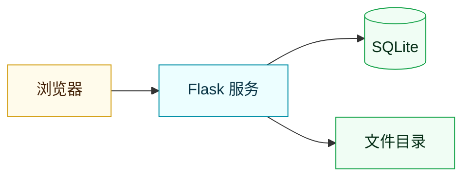
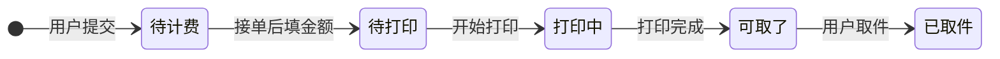

<div align="center">

<!-- 头图配色跟着设计令牌走：黄 #D4A017 → 青 #008FA6，改版后不再是原来的靛蓝 -->


一个轻量的 **小猫娘打印服务**：提交打印任务、接单处理、完成取件全流程在一个网页里跑完。
纯 Web 界面，不需要安装客户端。

<br />

<!-- 技术栈徽章 -->
<a href="https://www.python.org/"></a>
<a href="https://flask.palletsprojects.com/"></a>
<a href="https://www.sqlite.org/"></a>


<!-- 前端技术栈徽章 -->
<a href="https://vuejs.org/"></a>
<a href="https://www.typescriptlang.org/"></a>
<a href="https://www.naiveui.com/"></a>
<a href="https://tailwindcss.com/"></a>
<a href="https://vite.dev/"></a>

<!-- 项目状态徽章 -->


<!-- 下面这几个徽章的数据由 GitHub 实时读出来，不用手动维护 -->


<br />
<br />

<!-- 仓库卡片（Socialify 生成）和 Star 曲线。
     这里本来放的是 github-readme-stats 的卡片，但它公共实例当时整站 503，
     连它自己项目的卡片都出不来，只好换成 Socialify。它哪天恢复了想换回去，
     把下面这个 <a> 里的 img 换成
     https://github-readme-stats.vercel.app/api/pin/?username=qcmb825&repo=print-of-dorm 即可。
     Star 曲线用 prefers-color-scheme 备了深浅两版，跟随 GitHub 的深浅色自动切。 -->
<a href="https://github.com/qcmb825/print-of-dorm">
  
</a>

<br />

<a href="https://star-history.com/#qcmb825/print-of-dorm&Date">
  <picture>
    <source media="(prefers-color-scheme: dark)" srcset="https://api.star-history.com/svg?repos=qcmb825/print-of-dorm&type=Date&theme=dark" />
    <source media="(prefers-color-scheme: light)" srcset="https://api.star-history.com/svg?repos=qcmb825/print-of-dorm&type=Date" />
    
  </picture>
</a>

</div>

---

## 📖 项目简介

一个轻量的**小猫娘打印服务**，把「提交任务 → 接单处理 → 完成取件」这条流程搬到网页上：

- **普通用户**：选文件 → 选黑白/彩色、单面/双面 → 留个备注 → 提交。提交后能随时看到任务卡在哪一步，还会拿到一个取件码。
- **管理员**：看到所有待接单的任务，**先到先得地接单**，处理完点一下把状态推到「可取了」。在此之上还能发布公告、查看数据看板、处理用户工单。

后端是**几个职责分明的 Python 模块**，前端是一个 **Vue 单页应用**（登录页、学生端、管理端都在同一个包里，按登录账号的角色切换界面）。
仓库里还保留着一版更早的**经典界面**，两套只是外壳不同、共用同一套接口，默认每个浏览器会话随机挑一套 ——
想固定成某套或者随时切过去看，见[「两套前端，怎么选」](#两套前端怎么选)。
前端构建产物已随仓库提供，**部署端不需要 Node**，也没有数据库服务要装——装好 Python 依赖、启动，就能用。

界面是响应式的（手机、平板、桌面各一套布局），有**明暗两套主题**：默认跟随系统，
选择会记在浏览器里。视觉语言是克制的黄 + 青、细边框、磨砂面板，动效只用在真正需要提示变化的地方。

---

## ✨ 功能一览

<table>
<tr><th width="140">模块</th><th>做了什么</th></tr>
<tr>
<td><b>账号体系</b></td>
<td>

- 登录 / 注册**同一个入口**，登录只需**学号 + 密码**
- 注册时填昵称、姓名、学号、宿舍，以及联系方式（微信号 / QQ / 邮箱，各按自己的格式校验）
- 注册时会拿学号去**学生名单库**里核验：名单上有、且姓名对得上才能直接注册
- 昵称、学号唯一，一个人只能有一个账号。**姓名允许重名** —— 身份的唯一标识是学号，
  姓名只是称呼（四万多人里同名同姓是常态，卡住第二个「张伟」没道理）
- **名单上没有 / 姓名对不上**时，可以在登录页提交一份**身份审核申请**（附联系方式），
  管理员人工核对后放行。一个学号只能提交一次申请，驳回会给出理由
- 三种角色：普通用户 / 管理员 / 超级管理员，自助注册的一律是普通用户
  （超管对外一律显示为「管理员」，见 `config.public_role()`）
- 首次启动按 `.env` 的 `SUPER_ADMIN_*` 创建一个内置管理账号。密码**必须**在首次启动前自己设好（至少 8 位），没配够程序会拒绝启动

</td>
</tr>
<tr>
<td><b>下单与接单</b></td>
<td>

- 上传文件、选打印方式、留备注，一步提交
- 可选黑白/彩色、单面/双面
- 两个人同时点「接单」，只有一个能成功，不会重复接同一单
- 支持「放弃接单」，订单退回待接单池
- 订单状态：**待计费** → 待打印 → 打印中 → 可取了 → 已取件

</td>
</tr>
<tr>
<td><b>计费</b></td>
<td>

- 用户提交订单后进入**待计费**，管理员接单、下载看过文件后，核对页数、颜色、单双面填金额
- **必须先接单才能计费**：金额是按文件本身算出来的（几页、黑白还是彩色、单面还是双面），
  没接过单就没人打开过那份文件，只能对着文件名猜价钱。「谁接单谁计费」
- 待计费的单**可以接**：它就是要人接过来看文件的，按钮不置灰；只有已取件的单接不了
- 填完金额订单自动进入「待打印」，用户端立刻能看到费用；金额**在取件前可以改**（订单台「改价」）
- **已取件的单不再改价**：取件时钱是当面结清的，所以这时是金额的终点。后端直接拒绝，
  订单台上的「改价」按钮也会置灰并写明原因
- **只有接单人（以及超管）能给这一单计费**：别人接了单，说明文件已经在他手上，
  两个人都往同一单上填价钱，后填的会把先填的盖掉
- **待计费的单不能跳过计费改状态**：直接标成「待打印」的话，这张单的金额永远是空的，
  打完印找不到人收钱
- 金额一律按「最多两位小数的十进制字符串」处理（`config.PRICE_RE`），不用浮点做校验
- 老库里遗留的历史订单金额为空，显示为「未计费」，状态照旧走，不会被强制迁到待计费
- 看板汇总「待计费单数」与「累计计费金额」

</td>
</tr>
<tr>
<td><b>文件下载</b></td>
<td>

- 只有**接单人**（以及超管）能下载订单文件
- 上传与取件分离：提交人只负责上传和看状态，实体文件归接单的管理员使用

</td>
</tr>
<tr>
<td><b>公告</b></td>
<td>

- 顶部悬浮公告栏，可设字体、字号、颜色
- 正文颜色会按 **WCAG 对比度**兜底：和当前主题的纸面撞车时自动换成可读的颜色，
  深浅两套主题下都看得清（管理页预览同时给出两套效果）
- 同一时间只有一条生效，历史公告留存，可随时切回或再编辑

</td>
</tr>
<tr>
<td><b>界面与主题</b></td>
<td>

- 全站只跑**新版界面**（Vue 3）。经典版代码与模板仍然保留在仓库里，但已经路由不到，
  界面切换的总开关在 `app.py` 的 `UI_SWITCH_ENABLED`
- 明暗两套主题，默认跟随系统偏好
- 响应式布局：桌面有侧栏、窄屏切成顶栏 + 抽屉，手机上不会横向溢出
- 公告、图表、表格都跟着主题换色，深色下不会留一块刺眼的白纸
- 尊重系统的「减少动效」偏好，开启后动效退化而不是硬放

</td>
</tr>
<tr>
<td><b>工单（站内信）</b></td>
<td>

- 用户遇到问题直接发站内工单，不用加好友
- 气泡对话界面，双方各有未读提示
- 支持多个管理员一起处理

</td>
</tr>
<tr>
<td><b>账号管理</b></td>
<td>

- 管理端的账号名单：昵称、姓名、学号、宿舍、联系方式、角色、状态、订单数、注册与最后登录时间
- **所有管理员都能看**（内置管理账号那一行除外，SQL 层就过滤掉了），
  但改角色、停用、注销这些操作只对**内置管理账号**开放 —— 普通管理员调用这些接口一律 403
- 内置管理账号的界面里藏着一处**高级视图**（连点侧栏品牌图标 5 次），展开后才有操作列：
  改资料、重置密码、停止 / 启用、注销、恢复、代发工单，以及查看明文密码
  （每次查看都写一条安全日志，页面上也会提醒「请勿截图或外传」）
- 高级视图只是**界面开关**，既不是身份也不是权限；关掉它之后连参数都不会再发出去，
  服务端也会每一个请求重新校验
- 注销的账号默认不进列表（历史账号没必要天天占一屏），勾选「含已注销」才会列出；
  没勾的时候列表顶部会写明「另有 N 个已注销未列出」，避免「名单里明明有这个人」的争议
- 恢复注销账号时，如果它的昵称或学号已被别人占走，会被拒绝并逐条列出占用者

</td>
</tr>
<tr>
<td><b>数据看板</b></td>
<td>

- 订单总量、已接单/未接单、待计费、累计计费金额、账号总数与启用/禁用、近 7 天新增
- 状态分布（含待计费）、彩色/单双面占比、近期趋势、接单排行
- 图表用 ECharts（按需引入，只有看板页会加载），**不走任何外部 CDN**，弱网下也能用

</td>
</tr>
<tr>
<td><b>日志与审计</b></td>
<td>

- 日志按用途分流（业务 / 访问 / 安全 / 第三方）
- 按大小自动轮转，磁盘不会被刷爆
- 敏感操作留痕，但**不记录任何凭据内容**

</td>
</tr>
</table>

---

## 👥 角色与权限

| 能力 | 普通用户 | 管理员 |
| :--- | :---: | :---: |
| 提交打印订单 | ✅ | ✅ |
| 查看自己的订单 | ✅ | ✅ |
| 提交身份审核申请 | ✅ | ✅ |
| 发起 / 回复工单 | ✅ | ✅ |
| 接单、处理订单 | ❌ | ✅ |
| **给订单计费 / 改价** | ❌ | ✅ |
| 下载订单文件 | ❌ | ✅ |
| 审核身份申请（通过 / 驳回 / 改判） | ❌ | ✅ |
| 数据看板、发布公告 | ❌ | ✅ |
| 查看账号名单（内置管理账号不在此列） | ❌ | ✅ |
| 停用 / 启用 / 改角色 / 注销 / 恢复 / 改资料 / 重置密码 / 代发工单 | ❌ | 🔑 |

> 权限校验统一在服务端完成，前端只是根据角色决定渲染哪些界面。
>
> 🔑 这些接口只对**部署时自动创建的那个内置管理账号**开放，
> 账号由 `.env` 的 `SUPER_ADMIN_*` 在首次启动时创建，普通管理员调用会返回 403。
> 界面上的「账号管理」页对所有管理员开放（只能看），这些能力收在内置账号的一处
> **无提示的隐藏入口**（连点侧栏品牌图标 5 次）之后 —— 界面上不会出现任何「超级管理员」字样。
>
> **注销不是删除**：注销只把账号置为不可登录，历史订单、工单等信息全部保留；
> 它占用的昵称和学号会被释放，可以重新注册，**也可以由内置账号恢复**
> （恢复时若昵称或学号已被别人拿走，会被拒绝并列出占用者）。
> （姓名本来就不唯一，不算「占用」，注销与否都不影响别人用同一个名字注册。）

---

## 🏗️ 技术栈

| 层 | 选型 |
| :--- | :--- |
| 语言 | Python 3.9+ / TypeScript 5 |
| 框架 | Flask |
| 数据库 | 标准库 `sqlite3` |
| 生产服务器 | waitress |
| 密码加密 | cryptography |
| 前端框架 | Vue 3 + Vue Router + Pinia |
| 前端组件库 | Naive UI |
| 前端样式 | Tailwind CSS v4（设计令牌驱动，明暗双主题） |
| 前端图标 | Lucide |
| 字体 | Space Grotesk（标题）/ DM Sans（正文）/ JetBrains Mono（数字、取件码），@fontsource 随产物自带，不走外部 CDN |
| 前端构建 | Vite（产物直接落进 `static/app/`，由 Flask 托管） |
| 图表 | ECharts（按需引入，只有看板页会加载） |

> 主题只有一处事实来源：颜色和动效曲线都写在 CSS 变量里，Tailwind 工具类和 Naive UI 的
> 主题覆盖都从这些变量反读，所以换主题时组件库和手写样式不会各说一套。

> 前端产物已入库，**部署机不需要 Node**；本机只有改前端时才需要 Node 20+。

---

## 🧠 架构



单机单体服务：浏览器访问一个 Flask 进程，数据写 SQLite，上传的文件落本地目录。

### 订单状态流转



**「待计费」只会在下单时进入，也不能靠改状态退回去。** 管理员能手动切换的状态是
`config.ORDER_STATUSES_MANUAL`（待打印 / 打印中 / 可取了 / 已取件），不含待计费 ——
否则一笔已收钱的单会被改回「待计费」，对账就乱了。接口收到待计费会直接 400。
**「已取件」可以被管理员改回去**（例如改回「可取了」），这是有意的运维约定，不是疏漏：
`PUT /api/order/<id>/status` 只校验取值在 `ORDER_STATUSES_MANUAL` 里，不拒绝已取件。
后果是 `/api/order/<id>/price` 只拒绝「已取件」的单，所以把状态从「已取件」改回去后，
改价的门会重新打开——先改状态、再改价，两步就能绕开「已取件不能改金额」。
这是知情选择：真实场景里确实存在取件后退回重新计价的需求，
与其偷偷挡住，不如写清楚让运维者自己判断。
反方向同样堵住了：停在「待计费」的单不能让 `PUT /status` 直接改成「待打印」，
跳过计费的结果是这张单永远没有金额，而**老库遗留的订单**（金额为空但不是待计费）不受影响，状态照旧走。

**顺序是「先接单、后计费」**：金额要看文件才算得出来，所以 `POST /price` 会先问
「这单有人接吗、是你接的吗」。待计费的单允许接单，接单按钮不会置灰。

**注意「接单」和「释放」只改归属，不改状态**：接单是把订单认领到自己名下（先到先得），
释放是退回待接单池，两者都不会碰 `status`（所以待计费的单接单之后，状态仍然停在待计费，
就等着接单人去填金额）。状态由接单人或超管在订单台手动切换，
后端只校验取值是否在 `ORDER_STATUSES_MANUAL` 里，**不强制流转顺序**（可以直接从「待打印」跳到「已取件」）。
所以上图是操作约定，不是系统强制的状态机。

---

## 🚀 快速开始

### 1. 准备

- Python **3.9 或以上**（我开发和部署用的是 3.11.9）
- Windows / Linux / macOS 都行，Windows 上验证得最多
- （可选，但想要「学号 + 姓名」注册核验就用）一份**学生名单库**，见下方「准备名单库」

<a id="roster"></a>

<details>
<summary><b>准备名单库（可选）</b></summary>

<br />

名单库是一个**独立的 SQLite 文件**（默认 `data/roster.db`），只需一张表：

```sql
CREATE TABLE students (num TEXT, real_name TEXT);
CREATE UNIQUE INDEX idx_students_num ON students(num);
```

- `num` 是学号（以字符串存，不要用整数 —— 前导零会没），`real_name` 是姓名。
- `real_name` **允许为空**：名单里有学号、没名字的条目相当于「这个人存在，但学校没登记姓名」，
  这种注册时直接放行，并把你填的姓名回填进名单，标记成 `self_reported`（学生自报）。
  这批数据在真实名单里不算少见，当成「查不到」会白白挡掉一批人。
- 名单库是**只读**打开的，服务不会往里面写（除了上面那种回填姓名的情况）。
- **文件不存在时服务照常启动**，只是注册会走到「名单不可用」的分支：所有人都会被引导去提交人工审核申请，
  而不是直接注册成功。日志里会有一条 error。

> 名单库被 `.gitignore` 忽略了 —— 里面是几万人的真实姓名 + 学号，绝对不能提交。
> 换机器 / 重装时得人工拷过去。

</details>

### 2. 装依赖

把项目放到服务器上（`git clone` 或直接拷目录），然后在项目根目录：

```powershell
python -m venv .venv
.\.venv\Scripts\python.exe -m pip install -r requirements.txt
```

Linux / macOS 换成 `.venv/bin/python -m pip install -r requirements.txt` 即可。

### 3. 生成两个密钥

这两个密钥**只在首次部署时生成一次，之后不要再换**（换了会掉线 / 已存的数据解不开）：

```powershell
# 会话签名密钥
.\.venv\Scripts\python.exe -c "import secrets; print(secrets.token_hex(32))"

# 密码加密密钥（连同结尾的 = 号一起复制）
.\.venv\Scripts\python.exe -c "from cryptography.fernet import Fernet; print(Fernet.generate_key().decode())"
```

### 4. 写 `.env`

在项目根目录新建 `.env`。仓库里的 `.env.example` 是**完整模板**（每个变量都带中文说明），
复制过去再改最省事：

```powershell
copy .env.example .env      # Linux / macOS 用 cp .env.example .env
```

**最小可用配置**长这样：

```ini
# 必填：两个密钥，填上第 3 步生成的值
SECRET_KEY=把上面第一个命令的输出粘这里
PASSWORD_ENC_KEY=把上面第二个命令的输出粘这里

# 必填：初始超级管理员。密码至少 8 位
SUPER_ADMIN_NICKNAME=superadmin
SUPER_ADMIN_PASSWORD=自己想一个至少 8 位的密码
SUPER_ADMIN_STUDENT_ID=2024001      # 它现在**就是登录名**，不能留空
# 下面两项可留空 = 存成空字符串
SUPER_ADMIN_REALNAME=
SUPER_ADMIN_DORM=

# 数据库默认落在项目根的 data/ 目录（DATA_DIR），一般不用改这两项
DATABASE_PATH=data/print_service.db
ROSTER_DB_PATH=data/roster.db
# 上传目录建议指到项目外的数据盘：升级代码时完全不会碰到用户上传的文件
UPLOAD_FOLDER=D:/print_data/files/

# 生产环境必须是 false
DEBUG=false
```

> ⚠️ **`SUPER_ADMIN_PASSWORD` 首次启动必须填够 8 位。** 账号还没建、密码又不合格时，程序会**直接拒绝启动**，并在控制台打出 `[启动中止]` 和该补的变量名。
>
> 这是刻意设计的。以前的做法是随机生成一个密码、只在启动日志里留一行 `WARNING` —— 等于把管理员口令写进了日志文件，而日志恰恰是最容易被整包拷走、发给别人帮你看问题的东西。现在改成让部署错误在启动时就显形。
>
> ⚠️ **`SUPER_ADMIN_STUDENT_ID` 不能留空，也不能跟别人一样。** 登录用的是学号，而内置账号会在首次启动时
> 直接建好（不走注册流程，自然也不查名单）。所以这一项必须自己给一个学号，
> 并且**以后登录这个超管账号时，用的就是它**，不是昵称。
> 仓库模板里填的 `99999999999` 只是占位值，**上线前必须改成你自己的**。
>
> 账号建好之后，`SUPER_ADMIN_PASSWORD` 可以删掉：判断「账号是否已存在」排在密码校验**之前**，删掉不影响后续重启。
> 但 `SUPER_ADMIN_STUDENT_ID` 建议留着 —— 它上有唯一索引，多个内置账号学号不能重复。

> 路径类配置（`DATA_DIR` / `DATABASE_PATH` / `ROSTER_DB_PATH` / `UPLOAD_FOLDER` / `LOG_DIR`）
> 写相对路径时一律按 **`app.py` 所在目录**解析，不受启动目录影响。
> ⚠️ 但 **`UPLOAD_FOLDER` 在旧版本里是按启动目录解析的** —— 如果你当初靠这一点把它指到了别处，
> 升级后要改成绝对路径，否则它会指向项目根下的同名目录，老订单的文件就都找不到了。

### 5. 启动

```powershell
.\.venv\Scripts\python.exe app.py
```

程序会根据 `DEBUG` **自动选择服务器**，不用改命令：

| `DEBUG` | 实际用的服务器 | 适用场景 |
| :--- | :--- | :--- |
| `true` | Flask 内置开发服务器 | 本地调试，**会暴露源码，仅限本机** |
| `false` | **waitress** | 生产环境 |

首次启动会自动建表、按 `.env` 创建内置超级管理员账号，并在日志里打印一条**启动横幅**。

浏览器打开 `http://<服务器IP>:8080`，用超管账号（**学号 + 密码**）登录即可。

> 登录的口子只有学号：**昵称和姓名都不能当账号用**。因为姓名允许重名、昵称可以改，
> 拿它们当账号迟早碰到「两个人同名、密码恰好也一样」，连不上系统还无从解释。
> 学号有唯一索引，与学校名单一一对应。

### 6. 改前端（可选，只有改界面才需要）

前端源码在 `frontend/`，构建产物在 `static/app/`，**产物已入库**。
只是想把服务跑起来的话，这一步可以完全跳过；需要 **Node 20+**。

```powershell
cd frontend
npm install          # 首次执行
npm run dev          # 开发服务器 :5173，已把 /api 反代到 :8080
```

开发时**后端要同时跑着**（另一个终端执行 `python app.py`），`npm run dev` 只负责前端的秒级热更新。
开发服和 Flask 都打开时，**调试用 `:5173`**，`:8080` 那边拿到的仍是仓库里的旧产物。

改完要发布时：

```powershell
npm run typecheck    # 只做类型检查，可选
npm run build        # 先跑 vue-tsc 类型检查，再打包进 ../static/app/
```

`build` 里串了类型检查，**类型不过就不会出包**；急着出包可以临时用
`npm run build:only` 跳过，但别养成习惯。构建完记得把 `static/app/` 一起提交，
否则线上还是旧界面。`vue-tsc` 依赖 **TypeScript 5.x**，别顺手升级到 TS 7（那条路目前装不起来）。

> 提交产物请用 `git add -A static/app` **整目录对齐**。产物文件名带内容 hash，
> 改任何一个源文件都会让一批文件名跟着变（共享 chunk 会连锁），
> `git status` 里因此会出现一堆「已删除 + 未跟踪」。只挑几个提交的话，
> 少一个 chunk 就是线上白屏 —— 而且本地 `npm run dev` 完全看不出来。

### 7. 设成开机自启

Windows 上用 [nssm](https://nssm.cc/download) 把启动命令包成服务（开机自启 + 崩了自动拉起，不需要有人登录桌面）：

```powershell
nssm install PrintService "D:\print-service\.venv\Scripts\python.exe" "app.py"
nssm set PrintService AppDirectory D:\print-service
nssm set PrintService AppExit Default Restart
nssm set PrintService AppRestartDelay 3000
nssm start PrintService
```

> `AppDirectory` 必须设。不设的话服务的工作目录不是项目目录，相对路径会指向乱七八糟的地方。

Linux 上用 systemd 写一个 `.service`，`ExecStart` 指向 `.venv/bin/python app.py` 即可。

> ⚠️ **不要用 `gunicorn`**。它靠 `fork()` 工作，在 **Windows 上根本起不来**；即使在 Linux 上，多进程也会把内存里的限流阈值成倍放宽（见下方「已知不足」）。项目已装 `waitress`，`DEBUG=false` 时会自动启用。

---

## ⚙️ 配置项

全部通过 `.env` 注入，**优先级：系统环境变量 > `.env` 文件 > 代码里的默认值**。

<details>
<summary><b>展开常用配置</b></summary>

<br />

| 变量 | 默认值 | 说明 |
| :--- | :--- | :--- |
| `HOST` | `0.0.0.0` | 监听地址 |
| `PORT` | `8080` | 监听端口 |
| `DEBUG` | `false` | 生产必须 `false` |
| `DATA_DIR` | `data` | 数据目录：所有 SQLite 库文件（主库、名单库、迁移前的 `.bak` 备份）都落在这里 |
| `DATABASE_PATH` | `data/print_service.db` | 主数据库文件位置 |
| `ROSTER_DB_PATH` | `data/roster.db` | 学生名单库（学号 → 姓名），注册时校验身份用。**不在仓库里**，换机器 / 重装要人工拷过去 |
| `UPLOAD_FOLDER` | `data/uploads` | 打印文件目录。建议按第 4 步指到项目外的数据盘 |
| `MAX_UPLOAD_MB` | `50` | 单文件上传上限 |
| `ALLOWED_EXTENSIONS` | `pdf,jpg,jpeg,png,doc,docx` | 上传白名单 |
| `SECRET_KEY` | 空 | 会话签名密钥，**必须固定**，否则每次重启全体掉线 |
| `PASSWORD_ENC_KEY` | 空 | 密码加密密钥，**必须固定且与数据库同寿命**，换了旧密码解不开 |
| `SESSION_DAYS` | `7` | 登录状态保持天数 |
| `SESSION_COOKIE_SECURE` | `false` | cookie 是否只走 HTTPS。**拿到证书之后再改成 `true`**，提前改会变成「登录成功但一刷新就退出」 |
| `TRUST_PROXY` | `false` | 前面是否挂了反向代理（Nginx 等）。开了才会采用 `X-Forwarded-For` 里的真实客户端 IP；**直接暴露在公网时必须保持 `false`**，否则客户端可以伪造 IP 绕过限流、污染日志。开了之后来源 IP 取 `X-Forwarded-For` 的**最左值**，而标准反代用 `$proxy_add_x_forwarded_for` 是**追加**语义，最左项就是客户端自己写的值——因此开了它就必须保证应用不能被直连（只监听回环 / 防火墙限制），且反代应当**覆盖式写入**而不是追加。否则登录锁定、注册与审核限流、以及日志里的 `ip=` 全部可被伪造。 |
| `CORS_ORIGINS` | 空 | 跨域白名单，逗号分隔。**不要填 `*`**，并且**不要给 CORS 开 `supports_credentials`**（当前刻意没开，所以跨站拿不到会话 Cookie；一旦开启，配合已允许的 `X-CSRF-Token` 头就构成完整的跨站写能力）。留空 = 只允许同源（推荐）。 |
| `UI_MODE` | `random` | 默认给哪套前端（`classic` / `vue` / `random`，`config.py` 里写死的默认值是 `random`；写错的值不报错，只记一条 `logger.error` 再按 `random` 处理）。**目前已被 `app.py` 的 `UI_SWITCH_ENABLED = False` 铉死成新版**，所以这一项实际不生效；`?ui=` 参数同样静默失效（不报错、不记日志）。需要临时看经典版时，把那个开关改回 `True` 再重启 |
| `LOGIN_MAX_FAILS` / `LOGIN_LOCK_SECONDS` | `5` / `300` | 连续失败多少次锁定、锁多久（只在本进程内计数，见「已知不足」） |
| `LOG_CONSOLE` | `true` | 是否同时输出到控制台。服务化运行（NSSM / systemd）时建议改 `false` |
| `LOG_DIR` | `logs` | 日志目录，相对路径按 `app.py` 所在目录解析 |
| `LOG_MAX_BYTES` / `LOG_BACKUP_COUNT` | `5MB` / `10` | 日志轮转大小与保留份数 |

内置超级管理员也在 `.env` 里配置，共 5 项：`SUPER_ADMIN_NICKNAME`、`SUPER_ADMIN_PASSWORD`、
`SUPER_ADMIN_REALNAME`、`SUPER_ADMIN_STUDENT_ID`、`SUPER_ADMIN_DORM`。

> 完整清单和逐项说明见仓库里的 **`.env.example`**（它就是配置模板，新增配置项会同步补进去）。
> 日志级别、启动重试等少数变量直接读环境变量，实现在 `config.py` / `app.py`。

</details>

---

## 📡 接口一览

接口统一返回 `{"code": 0, "msg": "..."}`，`code != 0` 即失败。写操作（POST/PUT/PATCH/DELETE）
需要带上 `X-CSRF-Token` 请求头，令牌由页面入口和 `/api/me` 下发。

> 失败时 `code` 取**与 HTTP 状态码同一个值**（400/401/403/404/409/413/429/500/503），
> 前端只判 `code !== 0`，所以这个数字本身不参与判断、只用来对照日志。
> **不要**写成 `'code': 1` —— 上传与分片那一支（`routes/orders.py` / `routes/upload_chunks.py`）
> 早先正是这么写的，那是迁移期的遗留：它既不是 HTTP 状态码，也不是协议里任何约定的值，
> 照抄到新接口上会让「看 code 就知道出了什么事」这个用法彻底失效（29 处已统一）。
> 另外 `/hello` 返回纯文本，`/api/order/<id>/download` 返回文件二进制，这两个都不套上面这层信封。

只列主流程上用到的几个：

| 方法 | 路径 | 权限 | 说明 |
| :--- | :--- | :--- | :--- |
| `POST` | `/api/register` | 公开 | 注册（需通过名单核验，否则返回 409 + 可提交审核的提示） |
| `POST` | `/api/login` | 公开 | 登录，用**学号**当账号 |
| `POST` | `/api/audit-request` | 公开 | 提交身份审核申请（学号 / 姓名 / 联系方式 + 说明），同一学号只能提一次 |
| `GET` | `/api/audit-request/status` | 公开 | 查申请进度（学号 + 联系方式都对才给看，限流 20 次/小时） |
| `POST` | `/api/upload` | 登录 | 上传文件并提交订单（落「待计费」） |
| `POST` | `/api/order/preset` | 登录 | 预设下单：不传文件，直接套一条预设服务下单（学生端的另一条下单路径；带了文件会被 400 拒绝，频控与上传共用一个计数器） |
| `GET`/`PUT`/`POST`/`DELETE` | `/api/upload/chunked*` | 登录 | 大文件分片：建会话 / 列未完成会话 / 查进度 / 传分片 / 合并 / 取消（路径见 `routes/upload_chunks.py`） |
| `POST` | `/api/order/<id>/withdraw` | 登录 | 学生自助撤回**自己还没被接单**的订单 —— 唯一会真正 DELETE 订单行的接口，会在留痕里记一条指向已删订单的「本人撤回」 |
| `GET` | `/api/my-orders` | 登录 | 自己的订单列表（含金额） |
| `GET` | `/api/my-stats` | 登录 | 自己的下单汇总（各状态笔数 / 彩色单双面分布 / 近 14 天趋势）。**只有自己的数**：原先附带的「全站累计单数」属站点规模，已撤回（后端不再查该列）。**目前没有前端消费方**，保留原因由作者决定 |
| `GET` | `/api/board` | 登录 | 学生端「服务数据」：**我的概览**（我的单数 / 进行中 / 待我取件 / 名次）+ 排队情况（**有序数组**，还在流程里的四档，已取件的单已经出队）+ 下单榜（近 30 天 / 累计两张）。**响应里既没有金额、也没有站点规模**（总单数 / 近 7 天 / 今日 / 账号数 / 已取件数 / **全站单量趋势** / **全站未接单数**，SQL 就没查那几列）；榜上别人的昵称由服务端打码（`张*三`），只有自己那一行是完整的 |
| `GET` | `/api/orders` | 管理员 | 订单列表（含待接单池）。支持 `q=` 关键词（**一个框搜完**取件码 / 文件名 / 订单号 / 昵称 / 姓名 / 学号 / 宿舍 / 联系方式，其中订单号与学号是**精确相等**，其余模糊匹配）、`preset=` 按打印服务分组筛（数字 = 分组 id，`none` = 未归类；分组键是 `COALESCE(preset_group_id, preset_id)`，所以下单选了预设的单和事后被归进去的单会一起出来）、`exclude_done=1` 隐藏已取件 |
| `POST` | `/api/order/<id>/claim` | 管理员 | 接单（已取件的单会被拒绝；待计费的单**可以**接） |
| `POST` | `/api/order/<id>/price` | 管理员 | **计费 / 改价**。**必须先接单，且只有接单人（或超管）能调**；待计费 → 原子置为待打印，老单直接改金额；已取件的单拒绝改价 |
| `POST` | `/api/order/<id>/release` | 接单人 / 超管 | 放弃接单，退回待接单池（金额保留） |
| `PUT` | `/api/order/<id>/status` | 管理员 | 更新订单状态（普通管理员只能改自己接的单；不接受待计费） |
| `GET` | `/api/order/<id>/detail` | 管理员 | 订单详情 / 时间线（含 `order_logs` 的操作留痕） |
| `GET` | `/api/order/<id>/download` | 接单人 / 超管 | 下载订单文件 |
| `GET` | `/api/order/pickup` | 管理员 | **凭取件码核对**（柜台用）：只读，回这一单的完整信息，比列表多 `owner_real_name` / `owner_student_id` 两个字段（核对「来的是不是本人」靠的就是它们）。取件码会补零重试，同时命中多单时优先回还没取件的那张 |
| `POST` | `/api/order/pickup` | 管理员 | **凭取件码确认取件**。**只接受「可取了」的单**（打印中的单被柜台取走等于纸没出来就记账）；带条件的原子 UPDATE，同一份件不会被交给两个人；**不要求是接单人**（柜台交件的人常常不是接单那个），留痕里会写明是代谁交接的 |
| `PUT` | `/api/order/<id>/preset-group` | 管理员 | 把订单**归入 / 移出**某条打印服务分组（`preset_id` 传数字，传 `none` / `null` 取消归类）。改的是 `preset_group_id` 而不是 `preset_id`，因为后者含义是「下单时选了这条预设」；不限制给内置账号，它只动分组、不碰金额与状态 |
| `GET` | `/api/admin/audit-requests` | 管理员 | 身份审核列表（按状态筛，带三类计数） |
| `POST` | `/api/admin/audit-requests/<id>/review` | 管理员 | 审核（`approve` / `reject`，驳回必填理由） |
| `GET` | `/api/admin/users` | 管理员 | 账号名单。`?detail=1` 才解密明文密码（写审计），`?include_closed=1` 才含已注销；内置管理账号对普通管理员不可见，带着 `detail=1` 也会被静默忽略 |
| `PUT` | `/api/admin/user/<id>/profile` | 内置账号 | 改资料（昵称 / 姓名 / 学号 / 宿舍 / 联系方式，全量覆盖） |
| `PUT` | `/api/admin/user/<id>/password` | 内置账号 | 重置密码（强度校验 + 审计，**不记密码**） |
| `POST` | `/api/admin/user/<id>/restore` | 内置账号 | 恢复已注销账号；昵称或学号被占走时 409，响应里列出占用者 |
| `POST` | `/api/admin/user/<id>/ticket` | 内置账号 | 代发工单，首条消息以该学生的名义入库 |

> 公告、工单、看板等其余接口不逐一列出，实现见 `routes/` 下对应的模块。

---

## 🗄️ 数据模型

SQLite 单库，共 10 张表：

| 表 | 用途 |
| :--- | :--- |
| `users` | 账号（v11 加了 `pay_qr_file`，v13 加了 `session_epoch`，v14 加了独立的 `qq` 取件提醒字段） |
| `orders` | 打印订单（含 `price` / `priced_by` / `price_time` 三个计费列，v9 加的选项快照列 `preset_id` / `preset_content` / `copies` / `paper_type_id` / `paper_name` / `paper_remark`，v10 加的 `claim_alert_time`、v11 加的 `ready_notify_time`（两个都是邮件提醒的发信凭证列，前者管「超时没人接」、后者管「可取件了」），v12 加的 `preset_group_id`——管理员把订单归到哪条打印服务分组，NULL 表示未归类，读的时候用 `COALESCE(preset_group_id, preset_id)` 当分组键，所以下单选了预设的单和事后被归进去的单会一起出来） |
| `order_logs` | 订单操作留痕（谁、什么时候、把订单改成了什么） |
| `audit_requests` | 身份审核申请（学号唯一，只允许提一次） |
| `announcements` | 公告 |
| `tickets` / `ticket_messages` | 工单与消息 |
| `print_presets` | 预设打印服务（管理员维护，学生下单时可套用） |
| `paper_types` | 纸张类型（管理员自己加，不写死在代码里） |
| `schema_meta` | 结构版本，用于自动建表与升级 |

> `orders` 里那几个选项快照列（`preset_id` / `preset_content` / `copies` / `paper_type_id` /
> `paper_name` / `paper_remark`）和 `claim_alert_time` 对**老订单是 NULL，这是刻意的、不会被回填** ——
> 那些单子下的时候还没有这些选项，替它们编一个默认份数或默认纸张，只会让人分不清
> 哪一单是学生真的选过、哪一单是后来猜的。

> 学生名单是**另一个库**（`ROSTER_DB_PATH`，默认 `data/roster.db`），只读、不写、不同表，
> 所以不列在上面。

---

## 🔐 安全设计

<table>
<tr><th width="150">问题</th><th>做法</th></tr>
<tr>
<td><b>CSRF</b></td>
<td>

写操作（POST/PUT/PATCH/DELETE）必须带 `X-CSRF-Token` 请求头，与 `session['csrf']` 做常数时间比对；
令牌由页面入口 `/` 垫一张，`/api/me`、登录 / 注册 / 退出的响应各带回一张，CSRF 校验失败且
会话里本来就没有令牌时再补发一张 —— 并不是每个响应都换。登录成功后会重建会话，防会话固定。

> **令牌失效时前端会自己走回来。** 退出登录、会话到期、账号被禁用都会让服务端清掉会话，
> 这时前端手里那张令牌已经作废 —— 而新版是单页应用，页面内部跳转不会重新加载，
> 所以「退出登录 → 不刷新页面 → 直接再登录 / 注册」这条最短路径会撞上 403。
> 现在分两层兜底：退出登录的响应里会补发一张新令牌；后端在「会话里本来就没有令牌」时
> 再补发一张并标上 `reason: "csrf"`，前端据此自动重握手（请求一次 `/api/me`）并原样重发一次原请求。
> 令牌存在但对不上时**故意不补发**（那属于可疑请求，补发等于替伪造者开门）。
>
</td>
</tr>
<tr>
<td><b>存储型 XSS</b></td>
<td>

前端一律插值渲染、不拼接 HTML（公告正文这种管理员可写的内容也**绝不走 `v-html`**）。

</td>
</tr>
<tr>
<td><b>上传滥用</b></td>
<td>

扩展名白名单 + 大小上限 + 存盘重命名，三重收口。

</td>
</tr>
<tr>
<td><b>路径穿越</b></td>
<td>

下载前校验文件真实路径必须位于上传目录内。

</td>
</tr>
<tr>
<td><b>越权</b></td>
<td>

权限在服务端统一校验，跨人操作返回 403。

</td>
</tr>
<tr>
<td><b>账号枚举</b></td>
<td>

登录失败对外只回「账号或密码错误」。

</td>
</tr>
<tr>
<td><b>暴力破解</b></td>
<td>

同一个 **IP + 账号**连续失败达阈值后锁定一段时间；注册接口另有同类的 IP 限流。
计数存在进程内存里，多进程部署时每个进程各算一份（见「已知不足」）。

</td>
</tr>
<tr>
<td><b>密码存储</b></td>
<td>

登录校验用不可逆的 pbkdf2 哈希；另外存一份 Fernet 可逆密文，供内置管理账号在账号管理页查看凭据。**代价是数据库泄露等于全站明文密码泄露** —— `PASSWORD_ENC_KEY` 与库同机，挡不住拿到整机的人。

</td>
</tr>
<tr>
<td><b>审计留痕</b></td>
<td>

越权、拦截、异常访问等写进安全日志，不记录任何凭据内容。

</td>
</tr>
</table>

---

## 📋 日志系统

日志按用途分流，出问题直接找对应的文件：

| 文件 | 内容 |
| :--- | :--- |
| `app.log` | 业务日志：启动、注册、登录、订单流转 |
| `access.log` | 访问日志：方法、路径、状态码、耗时、IP |
| `security.log` | 安全日志：登录失败与锁定、越权、拦截、审计 |
| `other.log` | 框架与第三方库的告警 |

日志按大小自动轮转，不会撑爆磁盘。

> 🔒 `logs/` 里有客户端 IP、账号和操作记录，属于隐私数据。`.gitignore` 已忽略，**不要提交到仓库**。

---

## 📁 目录结构

```
print-of-dorm/
├── app.py                 # 入口：建应用、注册蓝图与请求钩子、错误处理、启动
├── config.py              # 环境变量加载、日志搭建、全部配置常量
├── security.py            # 安全事件与审计、密码哈希与可逆加密、CSRF、登录限流
├── db.py                  # SQLite 连接、建表与迁移、内置管理账号
├── auth.py                # login_required / roles_required 装饰器
├── identity.py            # 学生名单库（只读）：学号 → 姓名 核验，注册关口
├── utils.py               # 上传校验、取件码、分页、注册与审核校验、金额解析
├── notifier.py            # 未接单提醒：定时检查 + 同一笔单只提醒一次
├── mail/                  # 未接单提醒的邮件（发信凭证在 orders.claim_alert_time）
│   ├── __init__.py
│   ├── recipients.py      #   收件人：谁能收到提醒
│   ├── sender.py          #   发信
│   └── template.py        #   正文模板
├── routes/                # 按功能域拆分的 Blueprint
│   ├── __init__.py        #   蓝图注册
│   ├── account.py         #   注册 / 登录 / 登出 / 当前用户
│   ├── audit.py           #   身份审核申请：提交 / 查进度 / 管理端审核
│   ├── orders.py          #   上传下单 / 接单 / 释放 / 计费 / 改状态 / 下载 / 撤回
│   ├── order_options.py   #   打印预设与纸张规格（学生端读、管理端维护）
│   ├── upload_chunks.py   #   大文件分片上传
│   ├── admin.py           #   账号管理 / 数据看板
│   ├── announcements.py   #   公告
│   └── tickets.py         #   工单
├── templates/
│   └── index.html         # 经典版前端：单文件模板（登录页 + 用户端 + 管理端）
├── static/
│   ├── img/               # 经典版页面图片：背景照片、樱花花瓣、插画
│   └── app/               # 新版前端构建产物（入库，Flask 直接托管，部署机不需要 Node）
├── frontend/              # 新版前端源码（Vue 3 + TypeScript，只有改界面时才需要动）
│   ├── index.html         #   Vite 入口：首屏前先定好主题，避免刷新时闪白底
│   ├── vite.config.ts     #   构建配置：outDir 指向 ../static/app，base 为 /static/app/
│   ├── public/            #   静态直通资源（favicon.svg，原样复制，文件名不带 hash）
│   ├── src/
│   │   ├── api/           #   接口层：axios 实例（CSRF / 令牌轮换 / 错误归一）+ DTO 类型
│   │   ├── styles/        #   设计令牌与基础样式（明暗双主题、动效曲线与时长）
│   │   ├── theme/         #   从 CSS 令牌反读 Naive UI 主题、公告正文色的对比度兜底
│   │   ├── layouts/       #   学生端布局 / 管理端布局
│   │   ├── views/         #   各页面
│   │   │   ├── staff/     #     订单台、看板、公告、用户、工单、身份审核
│   │   │   └── student/   #     上传下单、我的订单、工单
│   │   ├── components/    #   跨页面复用组件（含审核申请弹窗）
│   │   ├── composables/   #   组合式函数（统一的操作反馈）
│   │   ├── charts/        #   ECharts 按需注册与图表 option 构造函数
│   │   ├── stores/        #   Pinia：登录态、主题、公告
│   │   ├── utils/         #   时间格式化、状态色映射、校验规则（后端规则的镜像）
│   │   └── router/        #   路由表与按角色的访问守卫
│   ├── tsconfig.json
│   └── package.json
├── requirements.txt       # 依赖清单
├── .env.example           # 配置项模板（复制成 .env 再改）
├── .gitignore
├── .gitattributes
└── README.md
```

本地跑起来之后还会多出这些（**都已在 `.gitignore` 里，不会提交**）：

```
├── .env                   # 真实配置，含密钥，绝对不要提交
├── .venv/                 # 虚拟环境
├── logs/                  # 日志文件
├── data/                  # 运行期数据（已 gitignore）：SQLite 库、迁移备份、默认的上传目录
├── print_files/           # 上传的原件（含学生提交的内容）
├── frontend/node_modules/ # 前端依赖（只有改前端时才存在）
├── memoryandtest/         # 本地工作目录：文档、笔记与测试脚本
└── *.md（除 README 外）    # 本地文档
```

所有 SQLite 库文件（主库、学生名单库、迁移前自动生成的 `.bak` 备份）都收在 `data/` 下，
不再散在项目根 —— 不和源码、前端产物混在一起，清理旧版本时才不会误伤。
学生上传的原件默认也在这里（`data/uploads`），但**建议按上面第 4 步改到项目外的数据盘**：
升级代码时完全不会碰到用户上传的文件。

> `data/` 整个目录已被 `.gitignore` 忽略（包括里面的名单库 —— 那是几万人的真实姓名 + 学号），
> 所以它**不在仓库里**：新克隆一份代码后并没有这个目录，服务启动时会自己建。

> 后端按职责拆成多个模块，各路由模块只依赖 `config` / `security` / `auth` / `utils` / `db`，**不反向依赖 `app.py`**，所以没有循环导入。

### 界面已经固定为新版

仓库里其实**还在两套界面**，共用同一套 `/api`：经典版 `templates/index.html`（单文件 Jinja 模板），
新版 `frontend/src/`（Vue 3 + TypeScript）。但**目前只跑新版**，经典版已经路由不到：

```python
# app.py
UI_SWITCH_ENABLED = False   # 总开关：关掉之后 _pick_ui() 永远返回 vue
```

开关关掉后，原来那套「`?ui=` 参数 > `UI_MODE` 环境变量 > 随机」的优先级全都不再生效，
`?ui=classic` / `?ui=vue` **静默失效**（不报错、不记日志、也不写 `pod-ui` Cookie），
前端里四个「换个界面」入口（经典版顶栏与登录页、新版账号菜单与登录页）也已经拆掉。

> 特意做成**静默**：参数是给人临时看另一套用的，铉死期间它已经没意义了。
> 如果对无效参数报 400，旧书签、别人发的链接全都会失效 —— 代价比静默大。
> 真的想切回经典版：把 `UI_SWITCH_ENABLED` 改回 `True` 重启。经典版代码与模板一直留着，没删。

> 因为新版用了 history 路由，`app.py` 对非 `/api`、非 `/favicon.ico` 的未知路径统一回页面入口，
> 否则用户刷新 `/my-orders` 这类深层链接会拿到 404 —— 这一条改动过就别再退回去。

> 主题切换入口（右上角的明暗切换按钮）也已经拆掉，**主题现在固定跟随系统偏好**。
> `.dark` 令牌、Naive UI 反读、图表与公告取色全都保留着 —— 它们服务的是系统深色偏好，
> 不是那个按钮。

---

## 🧩 已知不足与后续计划

> 待办与改进事项**统一在 [Issues](https://github.com/qcmb825/print-of-dorm/issues) 里跟踪**（见下方「未来路线图」）。
> 这里只留**部署前需要知道**的几条，末括号是它们在 issue 里的编号。

- [ ] **订单只增不减**。没有清理策略，时间久了数据库和上传目录会持续变大。
      管理端的订单列表已支持分页，但 `/api/my-orders`（学生自己的订单）目前一次全返回。
      学生自助撤回（`POST /api/order/<id>/withdraw`，见 `routes/orders.py` 的 `api_withdraw_order`）是**唯一**
      会真正 DELETE 订单行的路径，而且删完会在 `order_logs` 里留下一条指向已删订单的留痕（`order_id` 已经查不到那条单）——
      这是刻意的：事后要回答「那天那份文件是被本人自己撤掉的，不是丢了」，只有它答得上来。（#32）
- [ ] **看板页的图表包偏大**（ECharts 单页约 200KB gzip）。已经做成懒加载，学生端不会下载；如果以后弱网环境仍嫌慢，可以换成更轻的图表库或退回手写 SVG。
- [ ] **计费是手工填金额，不是自动计算**。系统不知道 PDF 有多少页、用户要打几份，所以得管理员自己看文件后填。下一步可以做「上传时解析页数 → 按单价自动出金额」。
- [ ] **钱只记了金额，没记支付状态**。现在只能“订单一笔款已收/未收”全靠人工对账，订单表里没有 `paid` 之类的字段，也没有任何对账单据导出。
- [ ] **没有自动化测试**。主要流程靠手工验证；前端有 `vue-tsc` 类型检查兜底，后端没有。（#6）
- [ ] **限流只在单进程内有效**。所有限流都落在 `security.py` 的两个**模块级字典**里：登录失败计数 `_login_failures`（键是「IP + 学号」，默认 5 次 / 锁 300 秒；只服务登录）和通用计数器 `_hits`（按窗口内的次数挡手抖与刷量）。两者都不落盘、不共享。`_hits` 里目前有 7 组键：注册 `register:`（1 小时 20 次提交；只数「提交」这一件事，字段格式没过的请求不计入 —— 昵称或学号填重了再改一次，不该把自己那栋楼的出口 IP 封掉）、上传与预设下单 `upload:`（60 秒 20 次）、分片建会话 `chunkinit:`（60 秒 30 次）、分片上传 `chunkpart:`（60 秒 240 次）、工单轮询 `ticketpoll:`（60 秒 240 次），以及**两个未登录也能调的接口** —— 提交身份审核申请 `audit:`（1 小时 3 次）和查审核进度 `auditquery:`（1 小时 20 次）。所以单进程的 `waitress` 是对的；一旦换成多进程（如 `gunicorn -w 4`），每个进程各算各的，阈值会被成倍放宽且毫无提示。真要多进程，得先把这些计数器挪到 Redis。（#33）
- [ ] **跨大版本升级会动表结构或索引**。`v3 → v4` 重建了 `users` 表，把列级 `UNIQUE` 换成部分唯一索引，好让注销的账号释放昵称 —— 迁移是「建新表 → 拷数据 → 删旧表 → 改名」四步走，中途失败会留下半成品。`v4 → v5` 只把姓名的唯一索引降级成普通索引（重名不再被拒绝注册），不碰表数据。`v5 → v6` 新建 `audit_requests` 表（身份审核），存量库不动。`v6 → v7` 给 `orders` 加三个计费列，走的是幂等的 `PRAGMA table_info` + `ALTER TABLE`，**老订单的金额为空，不会被强制改成「待计费」**。`v7 → v8` 新建 `order_logs` 留痕表、`v8 → v9` 新建 `print_presets` / `paper_types` 并给 `orders` 加六个选项快照列、`v9 → v10` 再加 `claim_alert_time`（「未接单邮件提醒」的发信凭证列），这三步都是只加新表或纯加列，靠幂等的 `CREATE TABLE IF NOT EXISTS` + `PRAGMA table_info` + `ALTER TABLE` 补上，没有重建表 —— `v10 → v11`：users 加 `pay_qr_file`（收款码**文件名**，目录由 `PAY_QR_FOLDER` 决定）、orders 加 `ready_notify_time`（「可取件邮件提醒」的发信凭证列）；`v11 → v12`：orders 加 `preset_group_id`（管理员把订单归到哪条打印服务分组，NULL 表示未归类，读的时候用 `COALESCE(preset_group_id, preset_id)` 当分组键）；`v12 → v13`：users 加 `session_epoch`（会话里存一份登录那一刻的值，改密码 / 登出 / 超管重置密码时把库里的值 +1，于是旧 Cookie 立刻失效）；`v13 → v14`：users 加独立 `qq` 字段，旧数据里 `contact_type='qq'` 的号码会迁入该字段，微信和邮箱仍留在其他联系方式中。都是纯加列，没有重建表；除已有 QQ 的定向搬迁外不编造、不回填数据 —— 所以 `SCHEMA_VERSION` 现在是 `'14'`。**v13 落地后所有人都会掉线一次**：升级前发出去的 Cookie 里没有这个值，第一个请求就会被判失效、要求重新登录 —— 这是「改密码即让旧 Cookie 失效」的必然代价，不是故障。**老订单的选项快照列一律是 NULL，不会被强制回填**（`copies`、`paper_name` 这些编一个默认值出来，只会让人分不清哪一单是真的选过；`claim_alert_time` 的 NULL 含义是「还没提醒过」，回填等于把没提醒过的单说成提醒过了）。**升级前务必备份数据库和上传目录。**（#5）
- [ ] **窄屏没有专门放大触控目标**。新版组件尺寸沿用 Naive UI 的默认高度，手机上的按钮偏小，要补得先覆写组件库的尺寸令牌。（#35）
- [ ] **两套前端要各自维护**。新版已经拆成模块（`frontend/src/`），经典版仍是单文件 `templates/index.html`。长期打算是让经典版退役，短期内改公共逻辑（比如后端字段改名）必须**两边同时改** —— 漏掉一边的典型症状是图表静默空白，不报错。（#46）

> 有一条相关的保护已经做进去了：库里有订单、却在 `schema_meta` 里查不到 `schema_version` 时（库文件被换过、`DATABASE_PATH` 指错），服务会**拒绝启动**并把决定权交回人手，而不是一声不吭把订单全删掉。

---

## 🗺️ 未来路线图

钱这条链已经走完了前两步（手工计价 + 看板营收统计），剩下的是自动化和对账：

- [x] ~~**手工计价**~~ —— 已完成：订单从「待计费」开始，管理员在订单台填金额
- [x] ~~**账目闭环（一半）**~~ —— 已完成：订单表有金额与定价人/时间，看板有累计计费
- [ ] **自动计价**——按页数 × 黑白/彩色 × 单面/双面算钱，单价做成配置项，下单时就给出预估金额。
  做这个的前提是能在服务端数出页数：PDF 可以直接读，Office 文档得先转成 PDF 才准。
- [ ] **付款联动**——生成收款码（或对接校园支付），到账后自动推进订单状态，取件仍用现有取件码核验。
- [ ] **支付状态与对账**——订单表加 `paid` / `paid_time`，配上按天/按月导出流水。
主线只有一件事：**让系统自己算得出该收多少钱、收得到钱、并且能把文件直接送到打印机上**——
自动计价 → 付款联动 → 打印机下发。

路线图**不再放在这份 README 里**，全部条目按阶段在 [Issues](https://github.com/qcmb825/print-of-dorm/issues) 里跟踪：

| label | 主题 | 里面是什么 |
| :--- | :--- | :--- |
| [`阶段A-前提`](https://github.com/qcmb825/print-of-dorm/issues?q=label%3A%E9%98%B6%E6%AE%B5A-%E5%89%8D%E6%8F%90) | 前提 | 迁移机制、自动化测试、页数解析、HTTPS —— 不做这些，后面的全是空谈 |
| [`阶段B-计价`](https://github.com/qcmb825/print-of-dorm/issues?q=label%3A%E9%98%B6%E6%AE%B5B-%E8%AE%A1%E4%BB%B7) | 自动计价 | 份数与纸张规格、价目表、计费规则、下单页预估金额 |
| [`阶段C-付款`](https://github.com/qcmb825/print-of-dorm/issues?q=label%3A%E9%98%B6%E6%AE%B5C-%E4%BB%98%E6%AC%BE) | 付款联动 | 支付状态、余额与扣款原子性、流水对账、渠道适配层 |
| [`阶段D-打印`](https://github.com/qcmb825/print-of-dorm/issues?q=label%3A%E9%98%B6%E6%AE%B5D-%E6%89%93%E5%8D%B0) | 打印机联动 | 管理端一键下发、防重复、参数映射、命令行注入防护 |
| [`阶段E-闭环`](https://github.com/qcmb825/print-of-dorm/issues?q=label%3A%E9%98%B6%E6%AE%B5E-%E9%97%AD%E7%8E%AF) | 闭环与异常 | 取件码核验、状态流转约束、退款、自助取消 |
| [`阶段F-配套`](https://github.com/qcmb825/print-of-dorm/issues?q=label%3A%E9%98%B6%E6%AE%B5F-%E9%85%8D%E5%A5%97) | 配套 | 通知、分页、清理、备份、前端欠账 |
| [`候选池`](https://github.com/qcmb825/print-of-dorm/issues?q=label%3A%E5%80%99%E9%80%89%E6%B1%A0) | 候选池 | 想到过、没排期 |
| [`待拍板`](https://github.com/qcmb825/print-of-dorm/issues?q=label%3A%E5%BE%85%E6%8B%8D%E6%9D%BF) | 待拍板 | 需要需求方决定，不该由实现者单方面拍板 |

**总览见 [#47](https://github.com/qcmb825/print-of-dorm/issues/47)** —— 目标形态、「付款和打印不必强绑定」这条关键判断、以及为什么 A 阶段是唯一有强制顺序的。

条目编号是**字母 + 序号**（如 `B.3`），跨 issue 引用时用编号。**字母不代表排期。**
做完一项就关掉对应 issue，不必再回来改文档。

---

## 🚫 明确不做

写下来是为了省掉每次都重新讨论一遍的力气。

- **多租户 / 多打印点**：这是宿舍里的一套服务，不是 SaaS。要做就得先重想权限模型。
- **移动 App / 小程序**：Web 已经响应式了，宿网里打开浏览器就能用。
  （如果将来转自助打印，自助终端上的界面是另一回事，到时候单独评估。）
- **微服务拆分 / 消息队列**：单机单体是**特性**不是缺陷，拆了只会更难部署。
  打印任务的串行化用一个进程内队列就够，不需要消息队列。
- **为了「现代」而上异步框架 / ORM / 连接池**：现在的同步 WSGI + 标准库 `sqlite3` 是刻意的选择
  （`requirements.txt` 里写了理由），低并发下它更简单也更稳。
- **第三方登录**：宿舍场景下学号就是身份，接 OAuth 是多此一举。
- **给超管看的明文密码再往外扩**：这个功能**存在**（`password_enc`，超管可解密查看原密码），
  但方向是反的 —— 数据库泄露就等于全站明文密码泄露。它的存废在
  [#45](https://github.com/qcmb825/print-of-dorm/issues/45) 讨论，有结论之前不再扩大。

---

## 📄 版权声明

**Copyright © 2026. All Rights Reserved.**

本项目为个人作品，代码仅供学习与参考，**未授予任何开源许可**。

未经作者书面许可，不得用于商业用途，不得二次分发，不得删除或修改本声明。
如需实际部署使用，请先联系作者。

---

<div align="center">

**如果这个项目帮到了你，点个 ⭐ 就是最好的支持。**

<sub>Made with ☕ and a lot of <code>netstat -ano | findstr :8080</code></sub>

</div>
